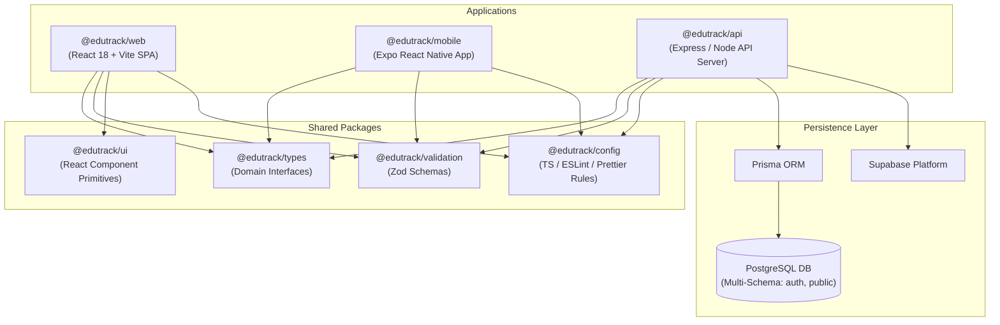
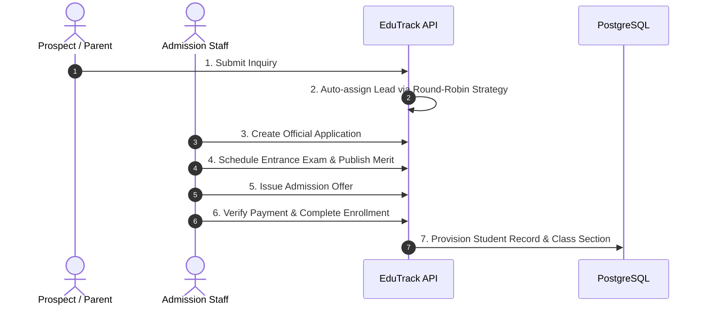

# EduTrack Enterprise Platform

[](https://pnpm.io/)
[](https://www.typescriptlang.org/)
[](https://react.dev/)
[](https://expo.dev/)
[](https://nodejs.org/)
[](https://www.prisma.io/)
[](https://www.postgresql.org/)
[](https://github.com/prettier/prettier)

Production-grade School Management & Institution ERP SaaS System engineered with a decoupled, high-performance monorepo architecture.

---

## 🏛️ Monorepo Architecture Overview

EduTrack leverages **pnpm Workspaces** and **Turborepo** to enforce strict type-safe boundaries between applications and shared packages:



---

## 📂 Workspace Topology

```text
EduTrack/
├── apps/
│   ├── backend/               # @edutrack/api (Node.js/Express/Prisma REST API)
│   ├── web_app/               # @edutrack/web (React 18 + Vite Admin Web Portal)
│   └── mobile_app/            # @edutrack/mobile (Expo React Native Cross-Platform App)
├── packages/
│   ├── config/                # @edutrack/config (Centralized TSConfig, ESLint, Prettier)
│   ├── types/                 # @edutrack/types (Shared TypeScript Interfaces)
│   ├── ui/                    # @edutrack/ui (Shared Component Primitives)
│   └── validation/            # @edutrack/validation (Shared Zod Schemas)
├── docs/                      # Enterprise Architecture Specifications
└── turbo.json                 # Monorepo Build Pipeline Orchestrator
```

---

## ⚡ Technology Matrix

| Domain               | Stack                          | Version         | Rationale                                                                           |
| :------------------- | :----------------------------- | :-------------- | :---------------------------------------------------------------------------------- |
| **Monorepo Engine**  | `pnpm` + `Turborepo`           | `9.15` / `2.10` | Fast dependency resolution, zero duplication, and parallel cached task graphs.      |
| **Backend API**      | Node.js, Express, TypeScript   | `5.3`           | High-throughput asynchronous REST API server with custom RBAC and request tracing.  |
| **Database & ORM**   | PostgreSQL, Prisma ORM         | `5.22`          | Relational multi-schema data engine (`auth`, `public`) with static type generation. |
| **Web Portal**       | React 18, Vite, Tailwind CSS   | `5.4`           | Responsive, high-performance SPA with glassmorphism UI tokens and Radix primitives. |
| **Mobile App**       | Expo, React Native, NativeWind | `51.0`          | Cross-platform native mobile application targeting iOS and Android.                 |
| **State & Fetching** | Zustand, React Query           | `4.5` / `5.10`  | Unopinionated client state management and declarative server state caching.         |
| **Input Validation** | Zod                            | `3.22`          | End-to-end schema validation shared across API routes and React forms.              |

---

## 🚀 Quick Start Guide

### 1. Prerequisites

- **Node.js**: `^20.0.0`
- **pnpm**: `^9.15.4`
- **PostgreSQL**: `^15.0`

### 2. Installation

```bash
# Clone the repository
git clone https://github.com/YVI-TECHNOLOGIES-PVT-LTD/EduTrack.git
cd EduTrack

# Install monorepo dependencies
pnpm install
```

### 3. Development Workflow

```bash
# Start all dev servers (API, Web, Mobile)
pnpm run dev

# Or start specific applications individually
pnpm run dev:api       # Backend API (http://localhost:5000)
pnpm run dev:web       # Web Portal (http://localhost:5173)
pnpm run dev:mobile    # Expo Metro Bundler
```

---

## 🛠️ Monorepo Task Commands

| Command              | Purpose                                                                 |
| :------------------- | :---------------------------------------------------------------------- |
| `pnpm verify`        | Runs complete quality pipeline (`lint` + `typecheck` + `build`)         |
| `pnpm run lint`      | Lints all 7 workspace projects via ESLint                               |
| `pnpm run typecheck` | Validates TypeScript compilation across all workspaces (`tsc --noEmit`) |
| `pnpm run build`     | Builds production bundles for all applications and packages             |
| `pnpm run clean`     | Cleans `.turbo`, `node_modules`, and build artifacts                    |

---

## 🔄 Core Business Workflows

### Admissions CRM Pipeline (`apps/backend/src/modules/admission`)



---

## 📚 Complete Enterprise Architecture Documentation

For in-depth architectural guides, domain specs, and security matrices, refer to our comprehensive documentation suite:

- 📄 [REPOSITORY_AUDIT.md](file:///c:/Program%20Files/EduTech/REPOSITORY_AUDIT.md) — Enterprise Monorepo Discovery Audit
- 📄 [FOLDER_STRUCTURE.md](file:///c:/Program%20Files/EduTech/FOLDER_STRUCTURE.md) — Monorepo Directory & Ownership Analysis
- 📄 [ARCHITECTURE.md](file:///c:/Program%20Files/EduTech/ARCHITECTURE.md) — High-Level Architecture & Layer Diagrams
- 📄 [TECH_STACK.md](file:///c:/Program%20Files/EduTech/TECH_STACK.md) — Comprehensive Technology Matrix & Rationales
- 📄 [BACKEND_ARCHITECTURE.md](file:///c:/Program%20Files/EduTech/BACKEND_ARCHITECTURE.md) — Express, Modules, RBAC & Compatibility Layer
- 📄 [WEB_ARCHITECTURE.md](file:///c:/Program%20Files/EduTech/WEB_ARCHITECTURE.md) — React 18, Vite, Glassmorphism & State Architecture
- 📄 [MOBILE_ARCHITECTURE.md](file:///c:/Program%20Files/EduTech/MOBILE_ARCHITECTURE.md) — Expo SDK 51, Expo Router & Native Architecture
- 📄 [DATABASE_ARCHITECTURE.md](file:///c:/Program%20Files/EduTech/DATABASE_ARCHITECTURE.md) — PostgreSQL Multi-Schema ERD & Prisma Models
- 📄 [API_DOCUMENTATION.md](file:///c:/Program%20Files/EduTech/API_DOCUMENTATION.md) — REST API Endpoints, DTOs & Permission Code Reference
- 📄 [SHARED_PACKAGES.md](file:///c:/Program%20Files/EduTech/SHARED_PACKAGES.md) — Package Dependency Graphs & Exports Specification
- 📄 [DEVELOPER_GUIDE.md](file:///c:/Program%20Files/EduTech/DEVELOPER_GUIDE.md) — Developer Onboarding, Workspaces & CLI Reference
- 📄 [DEVOPS.md](file:///c:/Program%20Files/EduTech/DEVOPS.md) — GitHub Actions CI/CD Pipeline & Deployment Strategy
- 📄 [SECURITY.md](file:///c:/Program%20Files/EduTech/SECURITY.md) — Auth JWT, RBAC Permissions Matrix & Security Guidelines
- 📄 [BUSINESS_WORKFLOWS.md](file:///c:/Program%20Files/EduTech/BUSINESS_WORKFLOWS.md) — End-to-End Business Sequences & Event Flows

---

## 🔒 Security & Code Standards

- **Commit Governance:** Commits follow Conventional Commits standard enforced via Husky and Commitlint (`feat:`, `fix:`, `chore:`).
- **Static Code Analysis:** Pre-commit hooks automatically execute `eslint --fix` and `prettier --write`.

---

## 📄 License

Internal Proprietary Enterprise System — All Rights Reserved © YVI Technologies Pvt Ltd.
