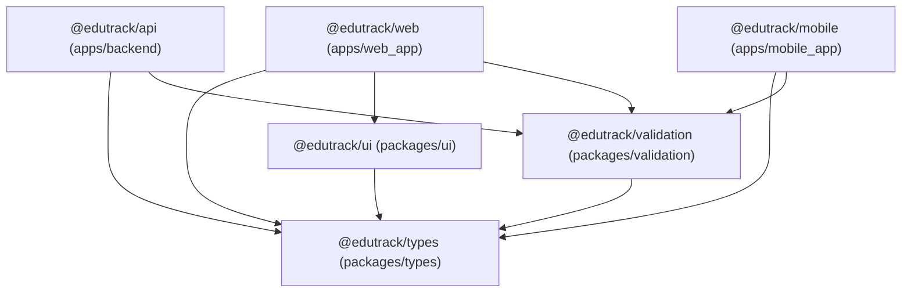

# EduTrack ERP — Workspace Dependency Report

## 1. Executive Summary

This document logs the dependency graph, workspace protocol references (`workspace:*`), and inter-package imports across the EduTrack monorepo.

---

## 2. Workspace Protocol Mapping



---

## 3. Package Audit Findings

### 3.1 Unimported Package Check

- Checked `@edutrack/database`: Verified NOT present and NOT referenced anywhere in the monorepo codebase. Creation was **skipped** to avoid introducing unneeded packages.

### 3.2 Mobile App Dependency Check

- Checked `@edutrack/mobile`: Verified that `@edutrack/ui` is **NOT imported** by `@edutrack/mobile`. In accordance with Phase 6 rules, `@edutrack/ui` dependency was **not added** to mobile's `package.json`.

---

## 4. Package Export Specifications

### `@edutrack/config` Exports (`packages/config/package.json`)

- `./tsconfig/base`: `./tsconfig/base.json`
- `./tsconfig/node`: `./tsconfig/node.json`
- `./tsconfig/react`: `./tsconfig/react.json`
- `./tsconfig/react-native`: `./tsconfig/react-native.json`
- `./typescript`: `./tsconfig/base.json`
- `./typescript/base`: `./tsconfig/base.json`
- `./typescript/node`: `./tsconfig/node.json`
- `./typescript/react`: `./tsconfig/react.json`
- `./typescript/react-native`: `./tsconfig/react-native.json`
- `./eslint/base`: `./eslint/base.js`
- `./eslint/node`: `./eslint/node.js`
- `./eslint/react`: `./eslint/react.js`
- `./eslint/react-native`: `./eslint/react-native.js`
- `./prettier`: `./prettier/index.json`

### `@edutrack/types` Exports (`packages/types/package.json`)

```json
"exports": {
  ".": {
    "types": "./src/index.ts",
    "default": "./src/index.ts"
  }
}
```

### `@edutrack/ui` Exports (`packages/ui/package.json`)

```json
"exports": {
  ".": {
    "types": "./src/index.ts",
    "default": "./src/index.ts"
  }
}
```

### `@edutrack/validation` Exports (`packages/validation/package.json`)

```json
"exports": {
  ".": {
    "types": "./src/index.ts",
    "default": "./src/index.ts"
  }
}
```
