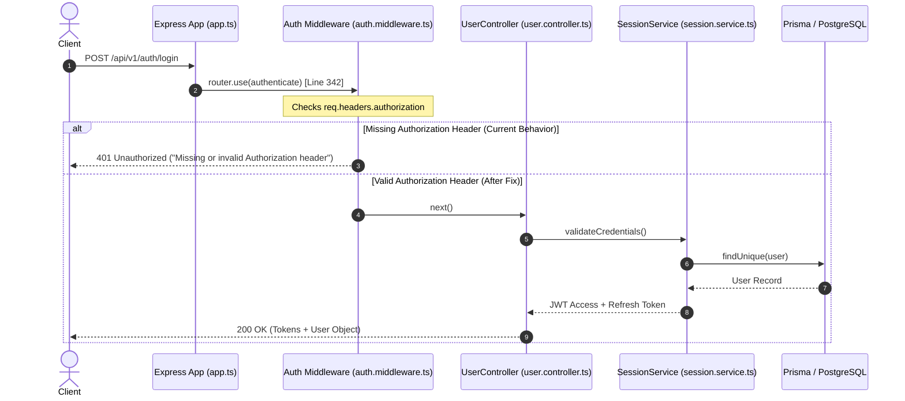

# Auth Flow Visualization Diagrams

```mermaid
sequenceDiagram
    autonumber
    actor Client
    participant Express as Express App (app.ts)
    participant AuthMW as Auth Middleware (auth.middleware.ts)
    participant UserCtrl as UserController (user.controller.ts)
    participant SessionSvc as SessionService (session.service.ts)
    participant Prisma as Prisma / PostgreSQL

    Client->>Express: POST /api/v1/auth/login
    Express->>AuthMW: router.use(authenticate) [Line 342]
    Note over AuthMW: Checks req.headers.authorization
    alt Missing Authorization Header (Current Behavior)
        AuthMW-->>Client: 401 Unauthorized ("Missing or invalid Authorization header")
    else Valid Authorization Header (After Fix)
        AuthMW->>UserCtrl: next()
        UserCtrl->>SessionSvc: validateCredentials()
        SessionSvc->>Prisma: findUnique(user)
        Prisma-->>SessionSvc: User Record
        SessionSvc-->>UserCtrl: JWT Access + Refresh Token
        UserCtrl-->>Client: 200 OK (Tokens + User Object)
    end
```
