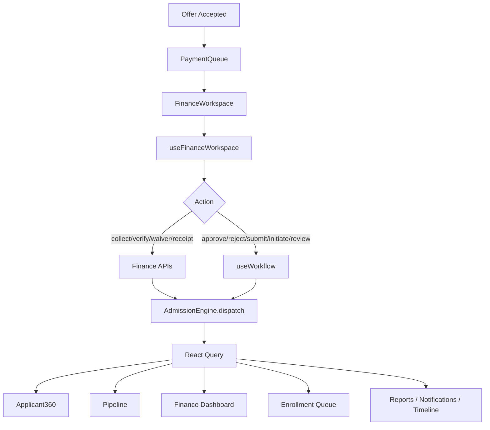
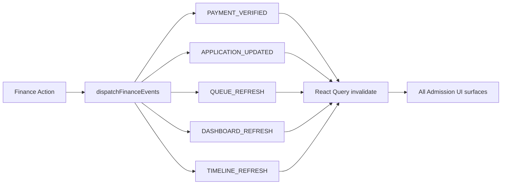

# Phase 5.10 — Enterprise Admission Finance & Fee Collection Workspace

**Status:** Production-ready vertical slice  
**Route:** `/app/admissions/fees`  
**Constraints:** Zero-risk — no schema, API, RBAC, routing, or backend changes

---

## 1. Enterprise Audit Report (Part 1)

| Area | Before | After |
|------|--------|-------|
| `FeeCollectionPage` | Mock Tarun/Anjali, client-side `totalAmount - paidAmount` | Thin wrapper → `FinanceWorkspace` |
| `fee/FeeCollectionPage` | Duplicate mock page | Thin wrapper → `FinanceWorkspace` |
| `FinanceDashboard` | Mock KPIs, mock ledger (Rohan/Preeti) | Live data via `usePaymentQueue` |
| Payment collection | Direct `collectMutation` on page | `runFinanceAction` → `planFinanceAction` → APIs |
| Payment verification | Direct `verifyMutation` | `verifyPayment` API via finance workflow |
| Outstanding balance | Frontend arithmetic | Backend `totalOutstandingAmount` from fees summary |
| Receipt numbers | Hard-coded mock | Backend `getReceipt` response only |
| Scholarship / waiver | None | `ScholarshipPanel`, `WaiverPanel` via workflow + `applyFeeWaiver` |
| Permissions | None on fee page | `canViewFinance`, `canCollectPayments`, `canVerifyPayments`, `canManageWaivers` |
| Events | Partial on collect/verify | Full cascade via `dispatchFinanceEvents` |
| Applicant360 / Pipeline | Partial refresh | Refreshes on `PAYMENT_VERIFIED`, `APPLICATION_UPDATED`, `QUEUE_REFRESH` |

**Removed:** Mock fee rows, alert-based UX, page-level mutations, local balance math, duplicate payment logic.

**Unchanged (by design):** Backend endpoints, RBAC contracts, routing, database schema, Admission Engine core.

---

## 2. Gap Matrix (Part 2)

| Gap | Severity | Impact | Dependencies | Files | Resolution | Regression Risk |
|-----|----------|--------|--------------|-------|------------|-----------------|
| Mock fee collection page | Critical | Wrong ops data | Payment APIs | `FeeCollectionPage.tsx` | `FinanceWorkspace` | Low |
| Client-side outstanding calc | Critical | Incorrect balances | `getFeesSummary` | `finance.mapper.ts` | Display backend fields only | Low |
| Direct page mutations | Critical | No sync | `useFinanceWorkspace` | Hook layer | Orchestrated actions | Low |
| Mock finance dashboard | High | Wrong KPIs | `usePaymentQueue` | `FinanceDashboard.tsx` | Live queue metrics | Low |
| No receipt viewer | High | Manual receipt lookup | `getReceipt` | `ReceiptViewer.tsx` | Backend receipt fetch | Low |
| Waiver requires component UUID | Medium | Manual component ID | `applyFeeWaiver` | `WaiverPanel.tsx` | Document limitation | None |
| Refund / reverse no dedicated API | Medium | Workflow review only | `useWorkflow` | `finance.workflow.ts` | Document limitation | Low |
| Scholarship status | Medium | Backend fee assignment | Fees summary | `ScholarshipPanel.tsx` | Verify via workflow audit | None |
| Payment ID for verify/receipt | Medium | User must supply UUID | Last collect response | `PaymentToolbar.tsx` | Auto-fill from last payment | Low |

---

## 3. Architecture Validation (Part 3)

```
Offer Accepted / payment_pending
        ↓
Payment Queue (usePaymentQueue)
        ↓
Finance Workspace
        ↓
useFinanceWorkspace
   ├─ useApplication + useFeesSummary + useTimeline
   └─ planFinanceAction()
       ├─ finance_api → collect / verify / waiver / receipt
       └─ workflow → verify_fee / submit_payment / initiate_payment / review
        ↓
Admission Engine (dispatch)
        ↓
Backend
        ↓
Admission Events
        ↓
Applicant360 · Pipeline · Dashboard · Timeline · Offer · Merit · Interview · Exam · Enrollment · Reports · Search · Communication
```



---

## 4. Finance Workspace (Part 4)

| Component | Purpose |
|-----------|---------|
| `FinanceWorkspace` | Main shell — queue list + detail workspace |
| `PaymentQueue` | Live finance application queue |
| `PaymentCard` | Candidate payment summary |
| `PaymentSummary` | Status KPI tiles from backend totals |
| `PaymentTimeline` | Audit-derived payment events |
| `PaymentHistory` | Historical payment actions |
| `PaymentAudit` | Finance audit trail panel |
| `ReceiptViewer` | Receipt display from `getReceipt` |
| `ReceiptHistory` | Receipt list (from fetched records) |
| `ScholarshipPanel` | Scholarship validation (workflow audit) |
| `WaiverPanel` | Fee waiver apply / approve / reject |
| `PaymentFilters` | Status filter chips |
| `PaymentToolbar` | All payment actions |

---

## 5. Finance Workflow (Part 5)

| UI Action | Plan Type | Backend Path |
|-----------|-----------|--------------|
| Collect Payment | `finance_api` | POST `/v1/admission/enrollment/payment/collect` |
| Verify Payment | `finance_api` | POST `/v1/admission/enrollment/payment/verify` (COMPLETED) |
| Reject Payment | `finance_api` / `workflow` | verify FAILED or `verify_fee` correction |
| Approve Payment | `workflow` | POST `/admissions/:id/verify_fee` (verified) |
| Submit Payment Proof | `workflow` | POST `/admissions/:id/submit_payment` |
| Initiate Payment | `workflow` | POST `/admissions/:id/initiate_payment` |
| Apply / Approve Waiver | `finance_api` | POST `/v1/admission/enrollment/fee/waiver` |
| Generate / Regenerate Receipt | `finance_api` | GET `/v1/admission/enrollment/payment/receipt/:id` |
| Verify Scholarship | `workflow` | POST `/admissions/:id/review` |
| Reject Waiver | `workflow` | POST `/admissions/:id/review` |
| Refund | `workflow` | POST `/admissions/:id/review` |
| Reverse Verification | `workflow` | POST `/admissions/:id/review` |
| Mark Pending | `workflow` | POST `/admissions/:id/review` |

All via `runFinanceAction()` — no page-level mutations.

---

## 6. Payment Engine (Part 6)

**Frontend never decides:**

- Payment status (maps backend + audit)
- Receipt number (from `getReceipt` only)
- Scholarship eligibility (display when present in fees summary)
- Waiver amount validation beyond required fields (backend enforces)
- Outstanding amount (from `totalOutstandingAmount`)
- Balance / fee split (from fees summary components)
- Receipt sequence (backend-generated)

---

## 7. Permission Matrix (Part 7)

| Role | View | Collect | Verify | Approve | Reject | Receipt | Waiver | Scholarship |
|------|------|---------|--------|---------|--------|---------|--------|-------------|
| Finance Officer | ✅ | ✅ | ✅ | ✅ | ✅ | ✅ | ✅ | ✅ |
| Accountant | ✅ | ✅ | ✅ | ✅ | ✅ | ✅ | ✅ | ✅ |
| Principal | ✅ | ✅ | ✅ | ✅ | ✅ | ✅ | ✅ | ✅ |
| Admission Officer | ✅ | ✅ | ❌ | ❌ | ❌ | ❌ | ❌ | ❌ |
| Parent | ✅* | ❌ | ❌ | ❌ | ❌ | ❌ | ❌ | ❌ |
| Student | ✅* | ❌ | ❌ | ❌ | ❌ | ❌ | ❌ | ❌ |
| Counselor | ❌ | ❌ | ❌ | ❌ | ❌ | ❌ | ❌ | ❌ |
| Exam Cell | ❌ | ❌ | ❌ | ❌ | ❌ | ❌ | ❌ | ❌ |

*With `admission.view_own` or parent role — read-only.

---

## 8. Synchronization (Part 8)

`dispatchFinanceEvents` fires:

| Event | Applicant360 | Pipeline | Dashboard | Timeline | Queues | Offer | Merit | Interview | Exam | Enrollment | Reports | Search | Communication |
|-------|--------------|----------|-----------|----------|--------|-------|-------|-----------|------|------------|---------|--------|---------------|
| PAYMENT_VERIFIED | ✅ | ✅ | ✅ | ✅ | ✅ | ✅ | ✅ | ✅ | ✅ | ✅ | ✅ | ✅ | via bus refresh |
| APPLICATION_UPDATED | ✅ | ✅ | ✅ | ✅ | ✅ | ✅ | ✅ | ✅ | ✅ | ✅ | ✅ | ✅ | ✅ |
| APPLICATION_LIST_CHANGED | ✅ | ✅ | — | — | ✅ | — | — | — | — | ✅ | — | ✅ | — |
| QUEUE_REFRESH | — | ✅ | ✅ | — | ✅ | ✅ | ✅ | ✅ | ✅ | ✅ | — | — | — |
| DASHBOARD_REFRESH | — | ✅ | ✅ | — | ✅ | — | — | — | — | — | ✅ | — | — |
| TIMELINE_REFRESH | ✅ | — | — | ✅ | — | — | — | — | — | — | — | — | — |



---

## 9. Production Validation (Part 9)

```
Offer Accepted
  → Payment Submitted (workflow)
  → Payment Collected (collectPayment)
  → Payment Verified (verifyPayment)
  → Receipt Generated (getReceipt)
  → Finance Dashboard / Applicant360 / Pipeline / Enrollment / Reports / Notifications / Timeline refresh
```

```bash
cd frontend && npm run build
```

Result: ✅ Zero TypeScript errors (verified).

---

## 10. Matrices & Guides (Part 10)

### API Matrix

| Action | Method | Endpoint |
|--------|--------|----------|
| Collect Payment | POST | `/v1/admission/enrollment/payment/collect` |
| Verify Payment | POST | `/v1/admission/enrollment/payment/verify` |
| Apply Waiver | POST | `/v1/admission/enrollment/fee/waiver` |
| Get Receipt | GET | `/v1/admission/enrollment/payment/receipt/:paymentId` |
| Fees Summary | GET | `/v1/admission/enrollment/fees/summary/:applicationId` |
| Verify Fee | POST | `/admissions/:id/verify_fee` |
| Submit Payment | POST | `/admissions/:id/submit_payment` |
| Initiate Payment | POST | `/admissions/:id/initiate_payment` |
| Review (scholarship/refund/reverse) | POST | `/admissions/:id/review` |

### Cache Matrix

| Key | Invalidated By |
|-----|----------------|
| `detail(appId)` | APPLICATION_UPDATED, PAYMENT_VERIFIED |
| `fees-summary(appId)` | PAYMENT_VERIFIED, APPLICATION_UPDATED |
| `timeline(appId)` | TIMELINE_REFRESH |
| `lists` | APPLICATION_LIST_CHANGED, QUEUE_REFRESH |
| `stats` | DASHBOARD_REFRESH |

### Event Matrix

| Event | Emitter | Subscribers |
|-------|---------|-------------|
| PAYMENT_VERIFIED | Finance hooks | Applicant360, queues, dashboards |
| APPLICATION_UPDATED | All finance actions | Full module |
| QUEUE_REFRESH | Finance success | Payment queue, pipeline |
| TIMELINE_REFRESH | Finance success | Timeline, 360 |

### Payment Matrix

| Status | Source | UI Display |
|--------|--------|------------|
| PENDING | App status + audit | Queue filter + card badge |
| SUBMITTED | `payment_submitted` | Verify action enabled |
| VERIFIED / COMPLETED | `verifyPayment` COMPLETED | Receipt action enabled |
| FAILED / REJECTED | `verifyPayment` FAILED | Re-collect path |
| Outstanding | `totalOutstandingAmount` | Summary + queue |

### Receipt Matrix

| Field | Source |
|-------|--------|
| Receipt number | `getReceipt` response |
| Issued at | Backend timestamp |
| Amount | Backend payment record |
| Payment ID | Collect response / user input |

### Scholarship Matrix

| Action | Path | Notes |
|--------|------|-------|
| View scholarship | Fees summary | Display-only |
| Verify scholarship | Workflow `review` | Audit remark recorded |

### Testing Matrix

| Test | Expected |
|------|----------|
| Open `/app/admissions/fees` | Live queue, no mock data |
| Select candidate | Fees summary + payment card load |
| Collect payment | API success + toast + refresh |
| Verify with payment ID | Status COMPLETED + event cascade |
| Apply waiver | Requires component UUID + amount |
| Generate receipt | Receipt viewer populated |
| Finance dashboard | Live KPIs from queue |
| Applicant360 link | Navigates without reload |
| Export | CSV from live record |
| Unauthorized role | Access denied message |

### Regression Matrix

| Surface | Risk | Mitigation |
|---------|------|------------|
| Offer workspace | Low | Shared events only |
| Enrollment queue | Low | PAYMENT_VERIFIED refresh |
| Legacy `usePayments` | Low | Re-exports preserved |
| `payment.mapper.ts` | None | Re-exports `finance.mapper` |

### Rollback Strategy

Revert `finance/*`, hooks, utils, `FeeCollectionPage` wrappers, `FinanceDashboard`, registry entry, permission helpers. No backend rollback required.

### Developer Guide

1. **Add a finance action:** Extend `FinanceAction` + `planFinanceAction()` in `finance.workflow.ts`.
2. **Wire UI:** Add button in `PaymentToolbar` or panel; call `runFinanceAction(action, payload)`.
3. **Never compute balances** in components — use `finance.mapper.ts` fields from API.
4. **Event sync:** All successful actions must call `dispatchFinanceEvents` (already in hook).
5. **Queue eligibility:** Extend filters in `usePaymentQueue` only if backend status exists.

### Finance User Guide

1. Open **Admissions → Fees** (`/app/admissions/fees`).
2. Filter queue by payment status; search by candidate name.
3. Select a candidate to open the finance detail workspace.
4. Review **Payment Summary** (totals from backend).
5. **Collect:** Enter amount, mode, reference → Collect Payment.
6. **Verify:** Enter payment ID from collect response → Verify.
7. **Waiver:** Enter fee component ID + amount → Apply Waiver.
8. **Receipt:** After verification, Generate Receipt.
9. Use **Applicant 360** link for full candidate context.
10. Finance Dashboard shows aggregate queue metrics (no mock ledger).

### Go-Live Checklist

- [ ] `npm run build` passes
- [ ] Finance roles assigned (FINANCE_OFFICER / ACCOUNTANT)
- [ ] Fee structure assigned before collection
- [ ] Payment gateway references tested for Online_Gateway mode
- [ ] Receipt printer/export tested
- [ ] Event cascade verified on Applicant360 without reload
- [ ] Parent read-only access confirmed

### Known Limitations

1. Refund, reverse verification, mark pending use workflow `review` (no dedicated finance APIs)
2. Fee component ID for waivers requires manual UUID entry
3. Payment ID for verify/receipt may need manual entry if collect response shape varies
4. Scholarship display depends on fees summary backend fields
5. Receipt history shows fetched receipts only (no list endpoint)
6. Legacy supabase billing paths unchanged — workspace uses v1 enrollment APIs

---

## Files Delivered

```
modules/admission/finance/
  FinanceWorkspace.tsx
  PaymentQueue.tsx
  PaymentCard.tsx
  PaymentSummary.tsx
  PaymentTimeline.tsx
  PaymentHistory.tsx
  PaymentAudit.tsx
  ReceiptViewer.tsx
  ReceiptHistory.tsx
  ScholarshipPanel.tsx
  WaiverPanel.tsx
  PaymentFilters.tsx
  PaymentToolbar.tsx
  index.ts

hooks/
  useFinanceWorkspace.ts
  usePaymentQueue.ts

utils/
  finance.mapper.ts
  finance.workflow.ts
  payment.mapper.ts (re-exports finance.mapper)

pages/
  FeeCollectionPage.tsx (thin wrapper)
  Workspace/FinanceDashboard.tsx (live queue)

core/
  AdmissionRegistry.ts (admissionFinance entry)
  AdmissionPermissions.ts (canViewFinance, canCollectPayments, canManageWaivers)
```
