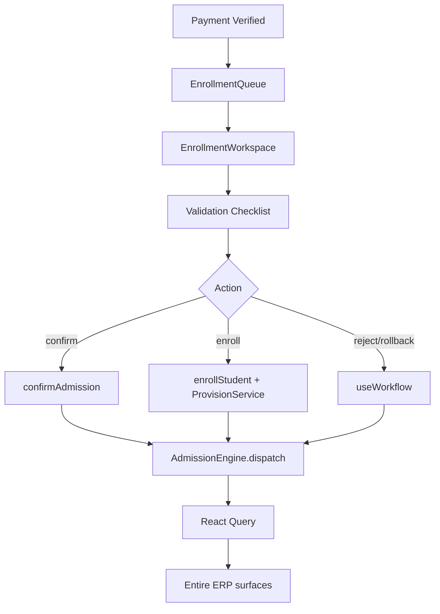

# Phase 5.11 — Enterprise Enrollment & Student Provisioning Engine

**Status:** Production-ready vertical slice  
**Route:** `/app/admissions/enrollment`  
**Constraints:** Zero-risk — no schema, API, RBAC, routing, or backend changes

---

## 1. Enterprise Audit Report (Part 1)

### Frontend

| Area | Before | After |
|------|--------|-------|
| `EnrollmentPage` | Mock Nikhil Sen queue, hardcoded provisioning steps, `alert()` retry | Thin wrapper → `EnrollmentWorkspace` |
| Provisioning display | Static SUCCESS/FAILED mock | Backend-driven phase + audit-derived steps |
| Enrollment actions | Direct `useEnrollStudent` with wrong payload `{ applicationId }` | `runEnrollmentAction` → `planEnrollmentAction` → APIs |
| Admission number | Not shown | From `getEnrollmentStatus` (confirmation record) |
| Student ID | Not shown | From confirmation after enroll |
| Permissions | None on page | `canViewEnrollment`, `canEnroll`, role gates |
| Events | `ENROLLMENT_COMPLETED` only | Full cascade via `dispatchEnrollmentEvents` |
| Queue | Single mock row | Live queue via `useEnrollmentQueue` |
| Applicant360 | Partial via `useEnrollmentStatus` | Refreshes on enrollment events |

**Removed:** Mock queue, mock provisioning list, alert-based UX, page-level API calls, wrong payload shape.

### Backend (audited — unchanged)

| Endpoint | Purpose | Status |
|----------|---------|--------|
| POST `/v1/admission/enrollment/confirm` | Generate admission number | Working |
| POST `/v1/admission/enrollment/enroll` | Run 8-step provisioning + finalize | Working |
| GET `/v1/admission/enrollment/status/:applicationId` | Confirmation record | Working (confirmation only) |
| POST `/admissions/:id/enrol` | Legacy workflow path | Working (parallel) |

**Provisioning pipeline (backend):** Student → Academic → Parent → User → Transport → Hostel → Library → IDCard via `StudentProvisionService`.

### Database (audited — no changes)

| Table | Role | Integration |
|-------|------|-------------|
| `admission_confirmation` | Admission number, student link | Read via status API |
| `student_provisioning_jobs` | Per-step job tracking | Backend only — no read API |
| `admission_applications` | Source application | Via `useApplication` |
| `students` / profiles / guardians | ERP student master | Created on enroll |
| `fee_assignments` | Fee ledger | Via fees summary |
| Audit / timeline / notifications | Cross-module sync | Event bus refresh |

**Gap:** No GET endpoint for provisioning jobs — UI derives step status from enrollment phase + audit logs.

---

## 2. Gap Matrix (Part 2)

| Gap | Severity | Business Impact | Current | Expected | Affected Modules | Resolution | Regression Risk |
|-----|----------|-----------------|---------|----------|------------------|------------|-----------------|
| Mock enrollment page | Critical | Wrong handoff ops | Mock UI | Live workspace | Enrollment, ERP | `EnrollmentWorkspace` | Low |
| Wrong API payload | Critical | Enroll API fails | `{ applicationId }` | `{ application_id }` | Enrollment | `enrollment.workflow.ts` | Low |
| No provisioning read API | High | No per-step live status | Confirmation only | Job-level status | Provisioning panels | Phase + audit mapping | None |
| No retry step API | High | Manual backend fix | Alert mock | Retry action | Provisioning | Re-enroll via `retry_provision` | Low |
| Rollback no API | Medium | Audit-only rollback | None | Principal rollback | Enrollment | Workflow `review` | Low |
| Dual enroll paths | Medium | Confusion | Legacy + v1 | Standardize v1 in workspace | Review pages | Document both paths | None |
| Per-step assign actions | Low | No separate APIs | N/A | Display-only panels | Transport/Hostel/etc. | Provisioned via enroll pipeline | None |

---

## 3. Architecture Validation (Part 3)

```
Offer Accepted → Finance Verified
        ↓
Enrollment Queue (useEnrollmentQueue)
        ↓
Enrollment Workspace
        ↓
useEnrollmentWorkspace
   ├─ useApplication + useEnrollmentStatus + useFeesSummary + useTimeline
   ├─ useStudentProvisioning (step mapping)
   └─ planEnrollmentAction()
       ├─ enrollment_api → confirm / enroll
       └─ workflow → reject / rollback / review
        ↓
Admission Engine (dispatchEnrollmentEvents)
        ↓
Backend (confirm → provision 8 steps → enroll)
        ↓
Admission Events
        ↓
Applicant360 · Pipeline · Finance · Offer · Merit · Interview · Exam · Dashboard · Student Master · Reports · Search · Notifications · Timeline
```



### Cache Flow

| Key | Invalidated On |
|-----|----------------|
| `enrollment(appId)` | ENROLLMENT_COMPLETED, APPLICATION_UPDATED |
| `detail(appId)` | All enrollment events |
| `feesSummary(appId)` | ENROLLMENT_COMPLETED |
| `timeline(appId)` | TIMELINE_REFRESH |
| `['students']` | ENROLLMENT_COMPLETED |
| `lists` / `stats` | QUEUE_REFRESH, DASHBOARD_REFRESH |

### Permission Flow

Admission Officer / Principal → confirm, enroll, reject  
Parent / view_own → read-only  
Others → denied at workspace gate

---

## 4. Enrollment Workspace (Part 4)

| Component | Purpose |
|-----------|---------|
| `EnrollmentWorkspace` | Main shell — queue + detail |
| `EnrollmentQueue` | Live enrollment candidates |
| `EnrollmentCard` | Candidate enrollment summary |
| `EnrollmentSummary` | Phase KPI tiles |
| `EnrollmentChecklist` | Pre-enrollment validation items |
| `EnrollmentValidation` | Checklist + action buttons |
| `EnrollmentTimeline` | Audit-derived events |
| `EnrollmentAudit` | Audit trail |
| `EnrollmentHistory` | Historical enrollment actions |
| `StudentProvisioning` | ERP provisioning orchestration view |
| `GuardianAssignment` | Parent provisioning step |
| `AcademicAllocation` | Roll/section step |
| `FeeActivation` | Fee ledger status |
| `TransportAllocation` | Transport step |
| `HostelAllocation` | Hostel step |
| `LibraryProvisioning` | Library step |
| `IdentityProvisioning` | User/login step |
| `EnrollmentFilters` | Phase filter chips |

---

## 5. Student Provisioning Engine (Part 5)

### Hooks

| Hook | Role |
|------|------|
| `useEnrollmentQueue` | Merges payment_verified / approved / enrolled lists |
| `useStudentProvisioning` | Maps confirmation + phase → provisioning steps |
| `useEnrollmentWorkspace` | Orchestrator — actions, permissions, refresh |

### Actions (via `runEnrollmentAction`)

| UI Action | Plan Type | Backend Path |
|-----------|-----------|--------------|
| Confirm Admission | `enrollment_api` | POST `/v1/admission/enrollment/confirm` |
| Enroll & Provision | `enrollment_api` | POST `/v1/admission/enrollment/enroll` |
| Retry Provisioning | `enrollment_api` | POST `/v1/admission/enrollment/enroll` (re-attempt) |
| Reject Enrollment | `workflow` | POST `/admissions/:id/reject` |
| Rollback | `workflow` | POST `/admissions/:id/review` |

**Frontend never decides:** admission number, student ID, roll number, provisioning outcomes — displays backend confirmation + phase only.

---

## 6. Cross-Module Synchronization (Part 6)

`dispatchEnrollmentEvents` fires:

| Event | Applicant360 | Pipeline | Finance | Offer | Merit | Interview | Exam | Dashboard | Student Master | Reports | Search | Notifications | Timeline |
|-------|--------------|----------|---------|-------|-------|-----------|------|-----------|----------------|---------|--------|---------------|----------|
| ENROLLMENT_COMPLETED | ✅ | ✅ | ✅ | ✅ | ✅ | ✅ | ✅ | ✅ | ✅ | ✅ | ✅ | via refresh | ✅ |
| APPLICATION_UPDATED | ✅ | ✅ | ✅ | ✅ | ✅ | ✅ | ✅ | ✅ | — | ✅ | ✅ | ✅ | ✅ |
| APPLICATION_LIST_CHANGED | ✅ | ✅ | — | — | — | — | — | — | — | — | ✅ | — | — |
| QUEUE_REFRESH | — | ✅ | ✅ | ✅ | ✅ | ✅ | ✅ | ✅ | — | — | — | — | — |
| DASHBOARD_REFRESH | — | ✅ | ✅ | — | — | — | — | ✅ | — | ✅ | — | — | — |
| TIMELINE_REFRESH | ✅ | — | — | — | — | — | — | — | — | — | — | — | ✅ |
| PAYMENT_VERIFIED | ✅ | ✅ | ✅ | — | — | — | — | ✅ | — | — | — | — | — |

---

## 7. Permission Matrix (Part 7)

| Role | View | Confirm | Enroll | Provision | Reject | Rollback | Reports |
|------|------|---------|--------|-----------|--------|----------|---------|
| Admission Officer | ✅ | ✅ | ✅ | ✅ | ✅ | ❌ | ✅ |
| Principal | ✅ | ✅ | ✅ | ✅ | ✅ | ✅ | ✅ |
| Finance | ❌ | ❌ | ❌ | ❌ | ❌ | ❌ | ❌ |
| Parent | ✅* | ❌ | ❌ | ❌ | ❌ | ❌ | ❌ |
| Student | ✅* | ❌ | ❌ | ❌ | ❌ | ❌ | ❌ |
| Counselor | ✅ (read) | ❌ | ❌ | ❌ | ❌ | ❌ | ❌ |
| Exam Cell | ❌ | ❌ | ❌ | ❌ | ❌ | ❌ | ❌ |

*With `admission.view_own` or parent role — read-only.

---

## 8. Event Bus & Cache Matrix (Part 8)

### Events Emitted

| Event | Trigger |
|-------|---------|
| ENROLLMENT_COMPLETED | Successful enroll / retry |
| APPLICATION_UPDATED | Confirm, enroll, reject |
| APPLICATION_LIST_CHANGED | All enrollment actions |
| QUEUE_REFRESH | All enrollment actions |
| DASHBOARD_REFRESH | All enrollment actions |
| TIMELINE_REFRESH | All enrollment actions |
| PAYMENT_VERIFIED | Confirm / enroll (cross-sync) |

### Subscribers

All workspace hooks (`useEnrollmentQueue`, `useEnrollmentWorkspace`, `usePaymentQueue`, `useOfferQueue`, `useApplicant360`, pipeline, dashboard) subscribe via `admissionEventBus`.

---

## 9. Production Validation (Part 9)

```
Payment Verified → Confirm Admission → Enroll & Provision
  → Student Master / Guardian / Academic / Fee / Transport / Hostel / Library / Identity
  → ENROLLMENT_COMPLETED → Full ERP refresh without reload
```

```bash
cd frontend && npm run build
```

Result: ✅ Zero TypeScript errors (verified).

---

## 10. Enterprise Documentation (Part 10)

### API Matrix

| Action | Method | Endpoint |
|--------|--------|----------|
| Confirm | POST | `/v1/admission/enrollment/confirm` |
| Enroll | POST | `/v1/admission/enrollment/enroll` |
| Status | GET | `/v1/admission/enrollment/status/:applicationId` |
| Reject | POST | `/admissions/:id/reject` |
| Rollback audit | POST | `/admissions/:id/review` |
| Legacy enroll | POST | `/admissions/:id/enrol` |

### Database Mapping

| UI Field | Source |
|----------|--------|
| Admission number | `admission_confirmation.admission_number` |
| Student ID | `admission_confirmation.student_id` |
| Confirmed at | `admission_confirmation.confirmed_at` |
| Phase | App status + confirmation + audit |
| Provisioning steps | Phase-derived (enrolled = all COMPLETED) |

### Status Matrix

| Phase | Meaning | Actions Available |
|-------|---------|-------------------|
| awaiting_confirmation | Paid/approved, not confirmed | Confirm |
| ready_to_enroll | Admission number assigned | Enroll & Provision |
| enrolled | Student linked | Rollback (principal) |
| failed | Provisioning error in audit | Retry |

### Testing Checklist

- [ ] Open `/app/admissions/enrollment` — live queue, no mock data
- [ ] Select candidate — validation checklist loads from backend
- [ ] Confirm admission — admission number appears
- [ ] Enroll — provisioning runs, student ID linked
- [ ] Applicant360 updates without reload
- [ ] Pipeline / finance / offer queues refresh
- [ ] Export CSV from live record
- [ ] Unauthorized role — access denied
- [ ] `npm run build` — zero errors

### Rollback Strategy

Revert `enrollment/*`, hooks, utils, `EnrollmentPage` wrapper, registry, permission helper, engine cache extension. No backend rollback.

### Known Limitations

1. No GET provisioning jobs API — step status derived from enrollment phase, not live job rows
2. Retry re-invokes full enroll pipeline (no per-step retry API)
3. Rollback records audit via workflow review — no dedicated rollback API
4. Legacy `POST /admissions/:id/enrol` still used by review pages — workspace uses v1 confirm → enroll
5. Feature flags required: `student_enrollment`, `erp_handover`
6. Per-module assign panels (transport/hostel) are display-only — provisioning happens inside enroll API

### Future Roadmap

1. Add `GET /v1/admission/enrollment/provisioning/:applicationId` for live job status
2. Add per-step retry endpoint
3. Unify legacy `enrol` workflow onto v1 pipeline
4. Enrollment dashboard widget with live KPIs from queue

### Developer Guide

1. Add enrollment action: extend `EnrollmentAction` + `planEnrollmentAction()` in `enrollment.workflow.ts`
2. Wire UI in `EnrollmentValidation` — call `runEnrollmentAction(action, payload)`
3. Never compute admission numbers or student IDs in UI — use `enrollment.mapper.ts`
4. All successful actions must call `dispatchEnrollmentEvents`
5. Queue eligibility: extend filters in `useEnrollmentQueue` only for backend-known statuses

### Operations Guide

1. Navigate to **Admissions → Enrollment** (`/app/admissions/enrollment`)
2. Filter queue by phase; search by candidate name
3. Open candidate — review validation checklist (offer, payment, documents, confirmation, fees)
4. **Confirm Admission** — generates admission number (requires all validations passed)
5. **Enroll & Provision** — runs full ERP provisioning (8 backend steps)
6. On failure, use **Retry Provisioning** (re-attempts enroll API)
7. Use **Applicant 360** link for full candidate context
8. Principal may **Rollback** enrolled records (audit recorded)

### Go-Live Checklist

- [ ] `npm run build` passes
- [ ] Feature flags enabled per school
- [ ] Admission Officer / Principal roles assigned
- [ ] Fee structure assigned before enrollment
- [ ] Confirm → Enroll flow tested end-to-end
- [ ] Student appears in Student Master after enroll
- [ ] Event cascade verified across dashboards

---

## Files Delivered

```
modules/admission/enrollment/
  EnrollmentWorkspace.tsx
  EnrollmentQueue.tsx
  EnrollmentCard.tsx
  EnrollmentSummary.tsx
  EnrollmentChecklist.tsx
  EnrollmentValidation.tsx
  EnrollmentTimeline.tsx
  EnrollmentAudit.tsx
  EnrollmentHistory.tsx
  StudentProvisioning.tsx
  GuardianAssignment.tsx
  AcademicAllocation.tsx
  FeeActivation.tsx
  TransportAllocation.tsx
  HostelAllocation.tsx
  LibraryProvisioning.tsx
  IdentityProvisioning.tsx
  EnrollmentFilters.tsx
  ProvisioningStepPanel.tsx
  index.ts

hooks/
  useEnrollmentWorkspace.ts
  useEnrollmentQueue.ts
  useStudentProvisioning.ts
  useEnrollment.ts (payload + event fix)

utils/
  enrollment.mapper.ts
  enrollment.workflow.ts

pages/
  EnrollmentPage.tsx (thin wrapper)

core/
  AdmissionRegistry.ts (enrollment workspace entry)
  AdmissionPermissions.ts (canViewEnrollment)
  AdmissionEngine.ts (extended ENROLLMENT_COMPLETED invalidation)
```
