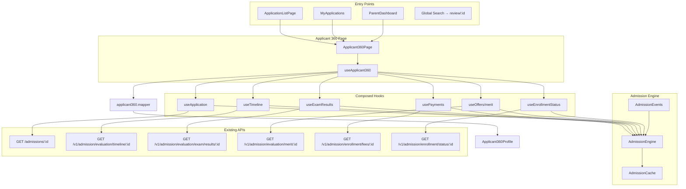

# Phase 5.3 — Applicant 360° (Enterprise ERP Release)

**Status:** Production-ready vertical slice  
**Date:** July 2026  
**Constraints:** Zero-risk — no schema, API contract, RBAC, routing, or auth changes

---

## Workflow Diagram



---

## Architecture Diagram

```
Applicant360Page (useParams :id)
        │
        ▼
useApplicant360 ──────────────────────────────┐
        │                                      │
        ├── useApplication → GET /admissions/:id
        ├── useTimeline → evaluation/timeline + audit fallback
        ├── usePayments → enrollment/fees + legacy payment fields
        ├── useExamResults → evaluation/exam/results
        ├── useOffers → evaluation/merit
        ├── useEnrollmentStatus → enrollment/status
        │
        ├── admissionEventBus subscribe → auto refetch
        │
        ▼
mapApplicant360View (single mapper — no duplicate status logic)
        │
        ▼
Applicant360Profile (7 tabs — all dynamic)
```

---

## API Matrix

| Data | Hook | API | Cache Key |
|------|------|-----|-----------|
| Application | `useApplication` | `GET /admissions/:id` | `['admissions','detail',id]` |
| Timeline | `useTimeline` | `GET /v1/admission/evaluation/timeline/:id` | `['admissions','timeline',id]` |
| Audit logs | embedded in application | `admission_audit_logs` on detail | same as detail |
| Documents | from application | `admission_documents` on detail | detail invalidation |
| Exam | `useExamResults` | `GET /v1/admission/evaluation/exam/results/:id` | `['admissions','exam-results',id]` |
| Merit | `useOffers` | `GET /v1/admission/evaluation/merit/:id` | `['admissions','merit-list',id]` |
| Fees | `usePayments` | `GET /v1/admission/enrollment/fees/:id` | `['admissions','fees-summary',id]` |
| Enrollment | `useEnrollmentStatus` | `GET /v1/admission/enrollment/status/:id` | `['admissions','enrollment-status',id]` |

---

## Role Matrix

| Role | Route access | Permission |
|------|--------------|------------|
| Parent | `/app/admissions/:id` (own) | `admission.view_own` |
| Counselor | Yes | `admission.review` or staff |
| Admission Officer | Yes | `admission.review` |
| Principal / Admin | Yes | staff permissions |
| Finance | Yes (read) | staff permissions |

---

## Status Matrix

| Legacy status | UI status | Timeline stage |
|---------------|-----------|----------------|
| draft | NEW | — |
| submitted | REVIEW | Application Submitted |
| under_review | REVIEW | Officer Review |
| docs_verified | DOCUMENTS | Document Verification |
| payment_* | FEE | Fee Collection |
| recommended | MERIT | Recommendation |
| approved | OFFER | Principal Approval |
| enrolled | ENROLLED | Enrollment |
| rejected | REJECTED | breached at review |

Mapping centralized in `AdmissionStatusMapper` + `applicant360.mapper`.

---

## Event Matrix

| Event | Triggers refetch on Applicant360 |
|-------|----------------------------------|
| APPLICATION_UPDATED | ✅ |
| APPLICATION_LIST_CHANGED | ✅ |
| DOCUMENT_VERIFIED | ✅ |
| PAYMENT_VERIFIED | ✅ |
| OFFER_SENT | ✅ |
| ENROLLMENT_COMPLETED | ✅ |
| INQUIRY_CONVERTED | ✅ |
| TIMELINE_REFRESH | ✅ |

---

## Cache Matrix

All keys under `ADMISSION_CACHE_KEYS` namespace. Invalidation via `AdmissionEngine.dispatch()` — no manual page reload.

---

## Manual Testing Checklist

- [ ] Open `/app/admissions/:id` with valid legacy admission ID
- [ ] Verify header shows real student name, email, phone, grade, status
- [ ] Verify document checklist reflects `admission_documents`
- [ ] Verify timeline tab shows workflow nodes + audit entries
- [ ] Verify fees tab shows payment status from application
- [ ] Verify comms tab loads CommunicationCenter
- [ ] Perform workflow action elsewhere (review page) → Applicant360 auto-refreshes
- [ ] Invalid ID → empty state with back link
- [ ] API error → retry button works
- [ ] Parent without permission → access denied message

---

## Known Limitations

1. **Dual stack IDs** — Route uses legacy `admissions.id`; v1-only applications need ID alignment
2. **Counselor name** — Not on legacy admission record; shows officer remark proxy or Unassigned
3. **SLA** — Frontend-computed from submission date (no backend SLA API)
4. **Exam/interview** — v1 evaluation APIs may return empty for legacy-only applications
5. **Communications history** — CommunicationCenter is compose-only; no persisted comms API yet

---

## Rollback Strategy

Revert `Applicant360/index.tsx`, `Applicant360Profile.tsx`, `useApplicant360.ts`, and remove `applicant360.mapper.ts`. No backend or DB changes to roll back.

---

## Future Improvements

- Additive aggregate endpoint `GET /v1/admission/applicant/:id/360` (optional)
- Link CRM lead counselor from enquiry conversion chain
- Persist communications to backend
- Unify global search to Applicant360 route for parents
