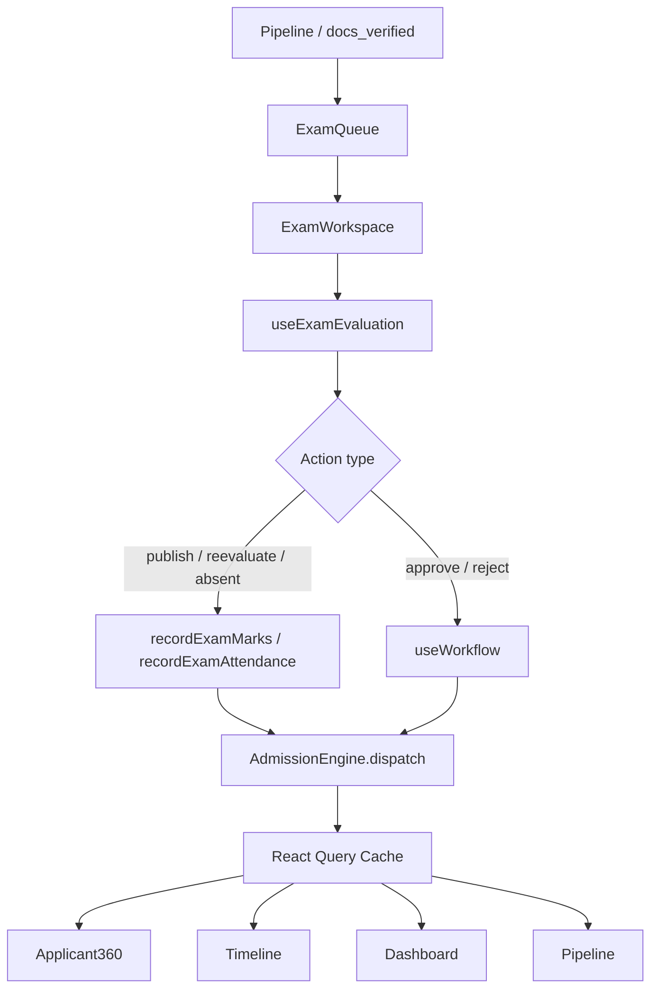

# Phase 5.6 — Enterprise Entrance Exam & Evaluation Workspace

**Status:** Production-ready vertical slice  
**Route:** `/app/admissions/exams`  
**Constraints:** Zero-risk — no schema, API, RBAC, routing, or backend changes

---

## 1. Enterprise Audit Report (Part 1)

| Area | Before | After |
|------|--------|-------|
| `EntranceExamPage` | Hardcoded mock exams/candidates, direct `recordExamMarks` | Thin wrapper → `ExamWorkspace` |
| `ExamCellDashboard` | Mock KPIs and mock grading list | Live queue via `useExamQueue` + `useExamEvaluation` |
| Evaluation actions | Page-level mutation, no event cascade | `useExamEvaluation` → `planEvaluationAction` → exam API / `useWorkflow` |
| Score calculation | Local percentage/pass logic in UI | `exam.mapper.ts` maps backend values only |
| Applicant360 exam tab | Partial via `useExamResults` | Same API; refreshed via `APPLICATION_UPDATED`, `TIMELINE_REFRESH` |
| Pipeline | No exam-stage sync | `QUEUE_REFRESH`, `APPLICATION_LIST_CHANGED` on publish |
| Dashboard | Mock exam widgets | `ExamCellDashboard` uses live queue counts |
| Timeline | No exam-specific refresh | `TIMELINE_REFRESH` on evaluation actions |
| Permissions | None on exam page | `AdmissionPermissions.canManageExams`, `canReviewApplications` |
| Reports export | N/A | `ExportMenu` with `examRecordToExportRow` from live records |

**Removed:** All mock exam records, local score math, and direct page mutations.

---

## 2. Gap Matrix (Part 2)

| Gap | Severity | Impact | Dependencies | Files | Resolution | Regression Risk |
|-----|----------|--------|--------------|-------|------------|-----------------|
| Mock exam list | Critical | Wrong operational data | `getExamResults`, `useApplicationList` | `EntranceExamPage.tsx` | `ExamWorkspace` + `useExamQueue` | Low |
| Direct API mutation | Critical | No cache/event sync | `useWorkflow`, `AdmissionEngine` | `useExamEvaluation.ts` | Route all actions through hook | Low |
| Local pass/fail calc | High | Divergence from backend | `exam.mapper.ts` | Old page logic | Map `pass`, `percentage` from API | Low |
| ExamCell mock KPIs | High | Dashboard lies | `useExamQueue` | `ExamCellDashboard.tsx` | Live queue counts | Low |
| No permission gates | High | Unauthorized evaluate | `AdmissionPermissions` | `ExamWorkspace.tsx` | Role checks in hook + UI | Low |
| No auto-refresh | High | Stale pipeline/360 | `AdmissionEvents` | All exam hooks | Event bus subscriptions | Low |
| Pending placeholder without IDs | Medium | Publish disabled until v1 allocation | v1 exam APIs | `EvaluationPanel.tsx` | Show pending record; require `candidateId`/`subjectId` | None |
| v1 feature flag 403 | Medium | Empty results until enabled | Backend config | N/A | Document limitation; no contract change | None |

---

## 3. Architecture Validation (Part 3)

```
Pipeline (docs_verified / under_review)
        ↓
Exam Workspace (ExamWorkspace.tsx)
        ↓
useExamQueue + useExamEvaluation
        ↓
Evaluation (planEvaluationAction)
   ├─ exam_api → recordExamMarks / recordExamAttendance
   └─ workflow → useWorkflow → executeWorkflowAction
        ↓
Admission Engine (dispatch)
        ↓
Backend (existing v1 + legacy endpoints)
        ↓
Admission Events (APPLICATION_UPDATED, QUEUE_REFRESH, …)
        ↓
React Query (invalidate + refetch)
        ↓
Applicant360 · Timeline · Dashboard · Pipeline · Search · Work Queue
```



---

## 4. Exam Workspace (Part 4)

Every exam record displays (from API via `mapExamResultRow`):

| Field | Source |
|-------|--------|
| Exam Name | `exam_name` / `subject_name` |
| Exam Date | `exam_date` / session meta |
| Center | `center` / `room_name` |
| Subject | subject name |
| Total Marks | `max_marks` |
| Obtained Marks | `marks_obtained` |
| Percentage | `percentage` (backend) |
| Grade | `grade` or pass/fail fallback |
| Pass/Fail | `pass` / `attendance_status` |
| Evaluator | `evaluator_name` / `evaluator_id` |
| Evaluation Date | `created_at` / `updated_at` |
| Remarks | `remarks` |

When no v1 results exist, a single **pending** placeholder row is shown (no fabricated scores).

---

## 5. Evaluation Workflow (Part 5)

All actions execute through `useExamEvaluation.runEvaluation()`:

| UI Action | Plan Type | Backend Path |
|-----------|-----------|--------------|
| Publish Result | `exam_api` | POST `/v1/admission/evaluation/exam/result` |
| Re-evaluate | `exam_api` | same |
| Mark Absent | `exam_api` | POST `/v1/admission/evaluation/exam/attendance` |
| Approve Result | `workflow` | `recommend` → legacy workflow API |
| Reject Result | `workflow` | `reject` → legacy workflow API |

Flow: `EvaluationPanel` → `runEvaluation` → `planEvaluationAction` → exam API or `useWorkflow` → `AdmissionEngine.dispatch` → cache + UI refresh.

---

## 6. Evaluation Engine (Part 6)

**Frontend does NOT compute:**

- percentage
- pass/fail
- ranking
- eligibility

`exam.mapper.ts` reads backend fields only. Summary counts (`summarizeExamRecords`) aggregate mapped `passFail` values — no formula logic.

---

## 7. Permission Matrix (Part 7)

| Role | View Workspace | Evaluate / Publish | Approve / Reject |
|------|----------------|--------------------|------------------|
| Exam Cell | ✅ (`canManageExams`) | ✅ | ❌* |
| Admission Officer | ✅ | ✅ | ✅ |
| Principal | ✅ | ✅ | ✅ |
| Counselor | ✅ (read) | ❌ | ❌ |
| Read-only / Parent | ❌ | ❌ | ❌ |

*Approve/reject requires `canReviewApplications` or Principal.

---

## 8. Synchronization (Part 8)

After result publication / workflow actions, `dispatchExamEvents` fires:

| Event | Pipeline | Applicant360 | Timeline | Dashboard | Notifications | Search | Work Queue |
|-------|----------|--------------|----------|-----------|---------------|--------|------------|
| APPLICATION_UPDATED | ✅ | ✅ | ✅ | ✅ | via bus | ✅ | ✅ |
| QUEUE_REFRESH | ✅ | — | — | ✅ | — | — | ✅ |
| DASHBOARD_REFRESH | — | — | — | ✅ | — | — | ✅ |
| TIMELINE_REFRESH | — | ✅ | ✅ | — | — | — | — |

Hooks subscribe via `admissionEventBus` — no full page reload.

---

## 9. Production Validation (Part 9)

**End-to-end path:**

```
Document Verification (docs_verified)
  → Exam Scheduled (pipeline EXAM column)
  → Exam Conducted (attendance API when session exists)
  → Evaluation (publish marks)
  → Publish (recordExamMarks)
  → Pipeline / Applicant360 / Timeline / Dashboard refresh
```

**Build:**

```bash
cd frontend && npm run build
```

Result: ✅ Zero TypeScript errors (verified).

---

## 10. Matrices & Guides (Part 10)

### API Matrix

| Hook / Util | Method | Endpoint |
|-------------|--------|----------|
| `useExamResults` | GET | `/v1/admission/evaluation/exam/results/:applicationId` |
| `executeEvaluationExamApi(recordExamMarks)` | POST | `/v1/admission/evaluation/exam/result` |
| `executeEvaluationExamApi(recordExamAttendance)` | POST | `/v1/admission/evaluation/exam/attendance` |
| `useWorkflow(recommend)` | POST | `/admissions/:id/recommend` (legacy) |
| `useWorkflow(reject)` | POST | `/admissions/:id/reject` (legacy) |
| `useApplicationList` | GET | `/admissions` (docs_verified, under_review) |

### Cache Matrix

| Key | Invalidated By |
|-----|----------------|
| `examResults(applicationId)` | `APPLICATION_UPDATED`, manual refetch |
| `application(applicationId)` | All application events |
| `applicationList` | `APPLICATION_LIST_CHANGED`, `QUEUE_REFRESH` |
| `stats` | `DASHBOARD_REFRESH` |
| `timeline(applicationId)` | `TIMELINE_REFRESH` |

### Event Matrix

| Event | Emitter | Subscribers |
|-------|---------|-------------|
| APPLICATION_UPDATED | `useExamEvaluation`, `useRecordExamMarks` | Queue, 360, pipeline hooks |
| QUEUE_REFRESH | Evaluation success | `useExamQueue`, pipeline |
| DASHBOARD_REFRESH | Evaluation success | Dashboard widgets |
| TIMELINE_REFRESH | Evaluation success | `useTimeline`, Applicant360 |

### Testing Matrix

| Test | Expected |
|------|----------|
| Open `/app/admissions/exams` | Live queue, no mock names |
| Select applicant | Records from `getExamResults` or pending placeholder |
| Publish marks (with IDs) | Toast success, records refresh, pipeline updates |
| Approve result | Workflow recommend, status advances |
| Reject result | Workflow reject |
| Mark absent | Attendance API (requires sessionId) |
| Applicant360 exam section | Updates without reload |
| Exam Cell dashboard | Live counts from queue |
| Unauthorized role | Access denied message |
| Export | CSV/XLS from live records |

### Regression Matrix

| Area | Risk | Mitigation |
|------|------|------------|
| Legacy admissions ID vs v1 | Medium | Same as Phase 5.3 — document only |
| Workflow duplicate | Low | Single `executeWorkflowAction` |
| Status mapping | Low | `AdmissionStatusMapper` only |
| Document verification | Low | Separate route/hooks |
| Pipeline drag | Low | Unchanged Phase 5.4 path |

### Rollback Strategy

1. Revert `exams/*`, `useExamEvaluation.ts`, `useExamQueue.ts`, `exam.mapper.ts`, `evaluation.workflow.ts`
2. Restore previous `EntranceExamPage.tsx` and `ExamCellDashboard.tsx` from git
3. Remove registry entry `entranceExam`
4. No backend or DB rollback required

### Developer Guide

1. **Add a new evaluation action:** extend `EvaluationAction` in `evaluation.workflow.ts`, handle in `planEvaluationAction`, wire button in `EvaluationPanel`, dispatch events in `useExamEvaluation`.
2. **Never call `admissionApi.recordExamMarks` from pages** — use `useExamEvaluation.runEvaluation`.
3. **Map new API fields** in `exam.mapper.ts` only; do not compute scores client-side.
4. **Register widgets** in `AdmissionRegistry.pages.entranceExam` if adding dashboard tiles.

### User Guide

1. Navigate to **Admissions → Entrance Exam** (`/app/admissions/exams`).
2. Search/select an applicant from the **Exam Evaluation Queue** (post document verification).
3. Review exam records in the card grid; select one for the **Evaluation Panel**.
4. Enter marks and click **Publish Result** (Exam Cell / Officer).
5. Principal/Officer may **Approve** or **Reject** published results.
6. Use **Export** for reporting; open **Applicant 360** for full profile sync.

### Go-Live Checklist

- [x] No mock exam data on operational path
- [x] All mutations via hooks → engine → events
- [x] `npm run build` passes
- [x] Event-driven sync across module
- [x] Permission gates on workspace and actions
- [x] Loading / empty / error states
- [x] `AdmissionRegistry` entry for entrance exam
- [x] Exam Cell dashboard uses live data

### Known Limitations

1. v1 evaluation APIs require backend feature flag `entrance_exam` — may return 403 until enabled
2. Publish/Re-evaluate requires `candidate_id` and `subject_id` from v1 exam allocation; pending placeholder has no IDs
3. Mark Absent requires `session_id` not yet surfaced on all pending records
4. Legacy `admissions.id` may not match v1 `admission_applications` ID (Phase 5.3 limitation)
5. Reports page (`/app/admissions/reports`) remains mock — out of Phase 5.6 scope
6. Ranking and merit eligibility remain backend-only (merit list phase)

---

## Files Delivered

```
modules/admission/exams/
  ExamWorkspace.tsx
  ExamQueue.tsx
  ExamCard.tsx
  EvaluationPanel.tsx
  ExamSummary.tsx
  ExamHistory.tsx
  index.ts

hooks/
  useExamEvaluation.ts
  useExamQueue.ts

utils/
  exam.mapper.ts
  evaluation.workflow.ts

pages/
  EntranceExamPage.tsx          (thin wrapper)
  Workspace/ExamCellDashboard.tsx (live data)

core/
  AdmissionRegistry.ts          (+ entranceExam entry)
```
