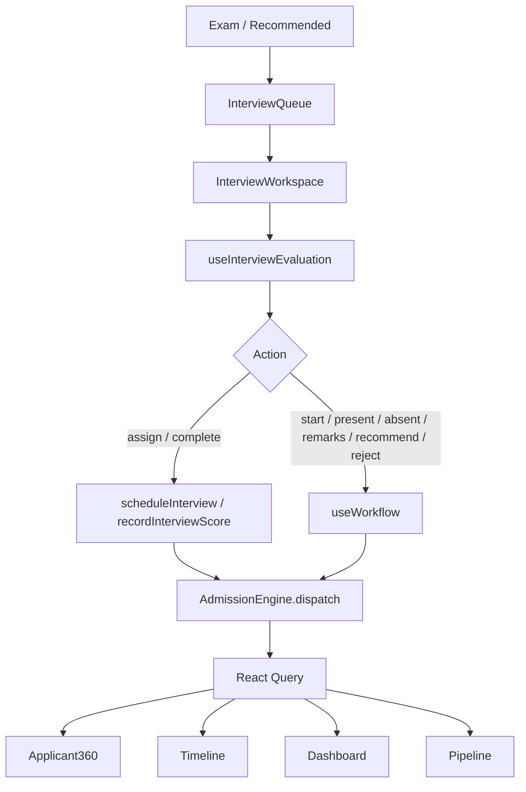

# Phase 5.7 — Enterprise Interview & Panel Evaluation Workspace

**Status:** Production-ready vertical slice  
**Route:** `/app/admissions/interviews`  
**Constraints:** Zero-risk — no schema, API, RBAC, routing, or backend changes

---

## 1. Enterprise Audit Report (Part 1)

| Area | Before | After |
|------|--------|-------|
| `InterviewPage` | Mock schedule, direct `recordInterviewScore`, local `rating * 20` | Thin wrapper → `InterviewWorkspace` |
| Panel evaluation | Page-level mutation, no event cascade | `useInterviewEvaluation` → `planInterviewAction` → interview API / `useWorkflow` |
| Score display | Client-side star × 20 scaling | `merit.final_score` from backend via `useMeritList` only |
| Recommendation | Local APPROVED/REJECTED toggle | `useWorkflow` recommend / reject |
| Queue | Hardcoded Anjali/Vijay | `useInterviewQueue` from live application lists |
| Permissions | None | `canManageInterviews`, `canEvaluateInterviews` |
| Events | Alert on success only | Full cascade: APPLICATION_UPDATED, QUEUE, DASHBOARD, TIMELINE |
| Applicant360 | Indirect via status | Refreshes on interview events |
| Pipeline | No interview sync | `APPLICATION_LIST_CHANGED` + `QUEUE_REFRESH` |

**Removed:** Mock interviews, local score math, direct page mutations.

---

## 2. Gap Matrix (Part 2)

| Gap | Severity | Impact | Dependencies | Files | Resolution | Regression Risk |
|-----|----------|--------|--------------|-------|------------|-----------------|
| Mock interview list | Critical | Wrong ops data | `useApplicationList` | `InterviewPage.tsx` | `InterviewWorkspace` + `useInterviewQueue` | Low |
| Local score × 20 | Critical | Divergence from backend | `useMeritList` | Old page | Map `final_score` only | Low |
| Direct API mutation | Critical | No cache sync | `useWorkflow`, engine | Hook layer | `useInterviewEvaluation` | Low |
| No GET interview API | High | Partial read path | Audit logs, merit | `interview.mapper.ts` | Parse audit + merit; document limit | None |
| No panel list API | Medium | Manual panel UUID | `scheduleInterview` | `PanelAssignment.tsx` | Panel ID input field | None |
| No criteria GET API | Medium | Manual criterion UUID | `recordInterviewScore` | `InterviewEvaluation.tsx` | Criterion ID + score entry | None |
| Attendance no API | Medium | Audit-only | `useWorkflow` review | `interview.workflow.ts` | Mark present/absent via review remark | Low |
| Dashboard mock KPIs | Low | Stale widgets | Separate phase | `DashboardPage.tsx` | Out of 5.7 scope | None |

---

## 3. Architecture Validation (Part 3)

```
Exam / Recommended applications
        ↓
Interview Queue (useInterviewQueue)
        ↓
Interview Workspace
        ↓
useInterviewEvaluation
   ├─ useApplication (audit logs)
   ├─ useMeritList (backend final_score)
   └─ planInterviewAction()
       ├─ interview_api → scheduleInterview / recordInterviewScore
       └─ workflow → useWorkflow → executeWorkflowAction
        ↓
Admission Engine (dispatch)
        ↓
Backend (existing v1 + legacy endpoints)
        ↓
Admission Events
        ↓
React Query invalidation
        ↓
Applicant360 · Timeline · Dashboard · Pipeline · Search · Work Queue
```



---

## 4. Interview Workspace (Part 4)

Every interview card displays (from audit logs + merit API — no hardcoded records):

| Field | Source |
|-------|--------|
| Candidate | `application.student_name` |
| Application No | `application.id` (short) |
| Program | `grade_applied_for` |
| Interview Date | Parsed from `INTERVIEW_SCHEDULED` audit remarks |
| Interview Slot | Audit `created_at` time |
| Panel Members | Parsed `[panel_name]` from schedule remark |
| Room | Parsed from schedule remark |
| Status | Derived from audit actions + app status |
| Attendance | Audit keywords / completion actions |
| Panel Score | `merit.final_score` (backend only) |
| Remarks | Audit / officer remarks |
| Recommendation | App status recommend/reject |
| History | Filtered `admission_audit_logs` |

---

## 5. Panel Evaluation Workflow (Part 5)

| UI Action | Plan Type | Backend Path |
|-----------|-----------|--------------|
| Assign Panel | `interview_api` | POST `/v1/admission/evaluation/interview/schedule` |
| Complete Interview | `interview_api` | POST `/v1/admission/evaluation/interview/result` |
| Start Interview | `workflow` | POST `/admissions/:id/review` |
| Mark Present | `workflow` | review + remark |
| Mark Absent | `workflow` | review + remark |
| Save Remarks | `workflow` | review + remark |
| Recommend | `workflow` | POST `/admissions/:id/recommend` |
| Reject | `workflow` | POST `/admissions/:id/reject` |

All actions route through `runInterviewAction()` — no page-level mutations.

---

## 6. Panel Scoring (Part 6)

**Frontend never calculates:**

- Overall score
- Average score
- Eligibility
- Recommendation (from scores)
- Ranking

`panelScore` maps `merit.final_score` or `merit.interview_score` when present. Criterion scores (0–10) are sent to backend; aggregation is server-side.

---

## 7. Permission Matrix (Part 7)

| Role | View | Assign Panel | Evaluate | Recommend / Reject |
|------|------|--------------|----------|-------------------|
| Exam Cell | ✅ | ✅ | ✅ | ❌* |
| Admission Officer | ✅ | ✅ | ✅ | ✅ |
| Principal | ✅ | ✅ | ✅ | ✅ |
| Interview Panel | ✅** | ❌ | ✅** | ❌ |
| Counselor | ✅ (read) | ❌ | ❌ | ❌ |
| Parent / Read-only | ❌ | ❌ | ❌ | ❌ |

*Recommend/reject requires `canReviewApplications` or Principal.  
**Requires `admission.interview.evaluate` permission.

---

## 8. Synchronization (Part 8)

`dispatchInterviewEvents` fires on every successful action:

| Event | Pipeline | Applicant360 | Timeline | Dashboard | Work Queue |
|-------|----------|--------------|----------|-----------|------------|
| APPLICATION_UPDATED | ✅ | ✅ | ✅ | ✅ | ✅ |
| APPLICATION_LIST_CHANGED | ✅ | — | — | — | ✅ |
| QUEUE_REFRESH | ✅ | — | — | ✅ | ✅ |
| DASHBOARD_REFRESH | — | — | — | ✅ | — |
| TIMELINE_REFRESH | — | ✅ | ✅ | — | — |

Dependency graph:

```
runInterviewAction
  → interview/workflow API
  → AdmissionEngine.dispatch (5 events)
  → admissionEventBus subscribers (useInterviewQueue, useApplicant360, usePipeline, useTimeline)
  → React Query invalidate (detail, timeline, lists, stats)
  → UI refetch without reload
```

---

## 9. Production Validation (Part 9)

**End-to-end path:**

```
Exam completed / recommended
  → Interview Scheduled (scheduleInterview)
  → Panel Assigned (audit INTERVIEW_SCHEDULED)
  → Interview Conducted (start / present via workflow)
  → Complete Interview (recordInterviewScore)
  → Recommend (workflow)
  → Pipeline / Applicant360 / Timeline / Dashboard refresh
```

**Build:**

```bash
cd frontend && npm run build
```

Result: ✅ Zero TypeScript errors (verified).

---

## 10. Matrices & Guides (Part 10)

### API Matrix

| Hook / Util | Method | Endpoint |
|-------------|--------|----------|
| `executeInterviewApi(scheduleInterview)` | POST | `/v1/admission/evaluation/interview/schedule` |
| `executeInterviewApi(recordInterviewScore)` | POST | `/v1/admission/evaluation/interview/result` |
| `useWorkflow(review)` | POST | `/admissions/:id/review` |
| `useWorkflow(recommend)` | POST | `/admissions/:id/recommend` |
| `useWorkflow(reject)` | POST | `/admissions/:id/reject` |
| `useMeritList` | GET | `/v1/admission/evaluation/merit/:applicationId` |
| `useApplicationList` | GET | `/admissions` |

### Cache Matrix

| Key | Invalidated By |
|-----|----------------|
| `detail(applicationId)` | APPLICATION_UPDATED |
| `merit-list(applicationId)` | Manual refetch after action |
| `timeline(applicationId)` | TIMELINE_REFRESH |
| `lists` | APPLICATION_LIST_CHANGED, QUEUE_REFRESH |
| `stats` | DASHBOARD_REFRESH |

### Event Matrix

| Event | Emitter | Subscribers |
|-------|---------|-------------|
| APPLICATION_UPDATED | Interview hooks | 360, queue, pipeline |
| APPLICATION_LIST_CHANGED | Schedule success | Queue, pipeline |
| QUEUE_REFRESH | All interview actions | Work queues |
| DASHBOARD_REFRESH | All interview actions | Dashboard widgets |
| TIMELINE_REFRESH | All interview actions | Timeline, Applicant360 |

### Testing Matrix

| Test | Expected |
|------|----------|
| Open `/app/admissions/interviews` | Live queue, no mock names |
| Select candidate | Card from audit + merit |
| Assign panel | scheduleInterview + audit log |
| Start / Present / Absent | Review workflow + toast |
| Complete interview | recordInterviewScore with criterion scores |
| Recommend / Reject | Workflow status change |
| Applicant360 | Updates without reload |
| Unauthorized role | Access denied |
| Export | CSV from live record |

### Regression Matrix

| Area | Risk | Mitigation |
|------|------|------------|
| Exam workspace | Low | Separate hooks/routes |
| Document verification | Low | Unchanged |
| Pipeline | Low | Shared event bus only |
| Legacy ID mismatch | Medium | Documented (Phase 5.3) |

### Rollback Strategy

1. Revert `interviews/*`, hooks, utils, `InterviewPage.tsx` wrapper
2. Remove `interviewEvaluation` from `AdmissionRegistry`
3. Revert `AdmissionPermissions` interview helpers
4. No backend/DB rollback required

### Developer Guide

1. Add actions in `interview.workflow.ts` → `planInterviewAction`
2. Wire UI in `InterviewEvaluation` / `PanelAssignment`
3. Dispatch events via `useInterviewEvaluation` only
4. Never compute scores client-side — use `useMeritList` for display
5. Attendance/status without dedicated APIs → `useWorkflow('review')` with audit remark

### User Guide

1. Go to **Admissions → Interviews** (`/app/admissions/interviews`)
2. Select a candidate from the queue
3. **Assign Panel** — enter panel UUID, date/time, room
4. **Start Interview** → mark present/absent → save remarks
5. **Complete Interview** — enter interview UUID, criterion UUID, score (0–10)
6. **Recommend** or **Reject** via workflow buttons
7. Open **Applicant 360** for full profile sync

### Go-Live Checklist

- [x] No mock interview data on operational path
- [x] All mutations via hooks → engine → events
- [x] `npm run build` passes
- [x] Event-driven sync across module
- [x] Permission gates
- [x] Loading / empty / error states
- [x] `AdmissionRegistry` entry
- [x] Documentation complete

### Known Limitations

1. No GET interview results endpoint — read path uses audit logs + merit API
2. Panel list and criteria require UUIDs (no list APIs on contract)
3. v1 interview APIs require backend feature flag `interview`
4. Merit score display requires `merit_engine` flag and generated merit
5. Legacy `admissions.id` vs v1 application ID mismatch (Phase 5.3)
6. Dashboard interview KPIs remain mock — out of Phase 5.7 scope
7. Interview ID not always in legacy audit logs — manual UUID entry for complete interview

---

## Files Delivered

```
modules/admission/interviews/
  InterviewWorkspace.tsx
  InterviewQueue.tsx
  InterviewCard.tsx
  PanelAssignment.tsx
  InterviewEvaluation.tsx
  InterviewSummary.tsx
  InterviewHistory.tsx
  index.ts

hooks/
  useInterviewEvaluation.ts
  useInterviewQueue.ts

utils/
  interview.mapper.ts
  interview.workflow.ts

pages/
  InterviewPage.tsx (thin wrapper)

core/
  AdmissionRegistry.ts (+ interviewEvaluation)
  AdmissionPermissions.ts (+ interview helpers)
  AdmissionCache.ts (+ interviewEvaluation key)
```
