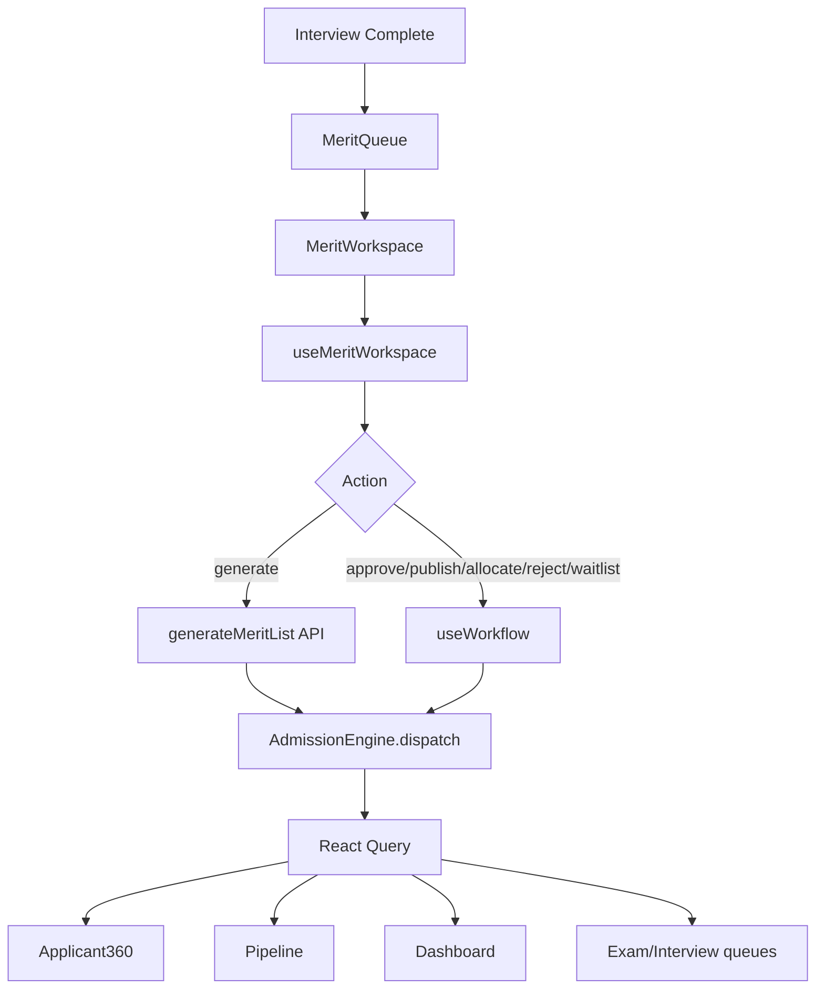

# Phase 5.8 — Enterprise Merit List & Selection Engine

**Status:** Production-ready vertical slice  
**Route:** `/app/admissions/merit`  
**Constraints:** Zero-risk — no schema, API, RBAC, routing, or backend changes

---

## 1. Enterprise Audit Report (Part 1)

| Area | Before | After |
|------|--------|-------|
| `MeritListPage` | Mock Suhail/Tanya/Abhinav, fake scores/ranks | Thin wrapper → `MeritWorkspace` |
| Generate merit | Direct mutation, partial events | `useMeritWorkspace` → `planMeritAction` → `generateMeritList` API |
| Ranking display | Hardcoded local array | Backend `generateMeritList` response mapped |
| Per-candidate merit | None | `useMeritList` + `useExamResults` per application |
| Selection actions | None | `useWorkflow` (approve, recommend, reject, review) |
| Permissions | None | `canGenerateMerit`, `canManageMeritSelection` |
| Events | `APPLICATION_LIST_CHANGED` only | Full cascade on all actions |
| Applicant360 | Partial merit via `useOffers` | Refreshes on merit events |

**Removed:** Mock merit rows, local rank/score data, direct page mutations.

---

## 2. Gap Matrix (Part 2)

| Gap | Severity | Impact | Dependencies | Files | Resolution | Regression Risk |
|-----|----------|--------|--------------|-------|------------|-----------------|
| Mock merit table | Critical | Wrong selection data | `generateMeritList` | `MeritListPage.tsx` | `MeritWorkspace` | Low |
| No event cascade on generate | High | Stale pipeline/360 | `AdmissionEngine` | `useGenerateMeritList` | Extended dispatch | Low |
| Local ranking | Critical | Divergence | Backend merit engine | Old page | Map API response only | Low |
| No per-app merit view | High | No operational detail | `getMeritList` | `useMeritWorkspace` | Compose hooks | Low |
| No selection workflow | High | Manual ops | `useWorkflow` | `merit.workflow.ts` | Workflow actions | Low |
| No GET all merit API | Medium | Batch view from generate only | POST generate | Document limitation | None |
| Waitlist/seat no dedicated API | Medium | Workflow remarks | `useWorkflow` | `WaitlistManager` | Review/approve paths | Low |

---

## 3. Architecture Validation (Part 3)

```
Exam + Interview completed
        ↓
Merit Queue (useMeritQueue)
        ↓
Merit Workspace
        ↓
useMeritWorkspace
   ├─ useMeritList (per-app backend merit)
   ├─ useExamResults (entrance score display)
   └─ planMeritAction()
       ├─ merit_api → generateMeritList
       └─ workflow → useWorkflow
        ↓
Admission Engine (dispatch)
        ↓
Backend
        ↓
Admission Events
        ↓
Applicant360 · Pipeline · Dashboard · Timeline · Exam · Interview workspaces
```



---

## 4. Merit Workspace (Part 4)

Every merit card displays (backend-mapped only):

| Field | Source |
|-------|--------|
| Candidate | `application.student_name` |
| Application | `application.id` |
| Program | `grade_applied_for` |
| Entrance Score | First exam result `percentage` from API |
| Interview Score | Merit/eval summary when present |
| Final Merit Score | `merit.final_score` |
| Category | `waitlist_group` |
| Rank | `merit.rank` |
| Seat Status | `selection_status` |
| Recommendation | App status / merit recommendation |
| Merit Status | Audit actions (MERIT_*) |
| History | Filtered audit logs |

---

## 5. Merit Workflow (Part 5)

| UI Action | Plan Type | Backend Path |
|-----------|-----------|--------------|
| Generate Merit | `merit_api` | POST `/v1/admission/evaluation/merit/generate` |
| Approve Merit | `workflow` | POST `/admissions/:id/approve` |
| Publish Merit | `workflow` | POST `/admissions/:id/recommend` |
| Allocate Seat | `workflow` | POST `/admissions/:id/approve` |
| Move Waitlist | `workflow` | POST `/admissions/:id/review` |
| Freeze Rank | `workflow` | POST `/admissions/:id/review` |
| Reject | `workflow` | POST `/admissions/:id/reject` |

All actions via `runMeritAction()` — no page mutations.

---

## 6. Ranking Engine (Part 6)

**Frontend never calculates:**

- Rank
- Final score
- Category rank
- Reservation
- Merit percentage
- Eligibility

`mapMeritResultRow` reads backend fields. `MeritRanking` displays backend order (rank field only).

---

## 7. Permission Matrix (Part 7)

| Role | View | Generate | Approve/Publish | Allocate | Reject |
|------|------|----------|-----------------|----------|--------|
| Principal | ✅ | ✅ | ✅ | ✅ | ✅ |
| Admission Officer | ✅ | ✅ | ✅ | ✅ | ✅ |
| Exam Cell | ✅ | ❌* | ❌ | ❌ | ❌ |
| Counselor | ✅ (read) | ❌ | ❌ | ❌ | ❌ |
| Finance | ❌ | ❌ | ❌ | ❌ | ❌ |
| Parent | ❌ | ❌ | ❌ | ❌ | ❌ |

*Unless granted `admission.merit.generate`

---

## 8. Synchronization (Part 8)

`dispatchMeritEvents` on every success:

| Event | Applicant360 | Pipeline | Dashboard | Timeline | Exam/Interview queues |
|-------|--------------|----------|-----------|----------|------------------------|
| APPLICATION_UPDATED | ✅ | ✅ | ✅ | ✅ | ✅ |
| APPLICATION_LIST_CHANGED | ✅ | ✅ | — | — | ✅ |
| QUEUE_REFRESH | — | ✅ | ✅ | — | ✅ |
| DASHBOARD_REFRESH | — | — | ✅ | — | — |
| TIMELINE_REFRESH | ✅ | — | — | ✅ | — |

---

## 9. Production Validation (Part 9)

```
Exam → Interview → Generate Merit → Approve → Publish → Allocate Seat
  → Pipeline / Applicant360 / Dashboard / Timeline refresh
```

```bash
cd frontend && npm run build
```

Result: ✅ Zero TypeScript errors (verified).

---

## 10. Matrices & Guides (Part 10)

### API Matrix

| Hook | Method | Endpoint |
|------|--------|----------|
| `executeMeritApi` | POST | `/v1/admission/evaluation/merit/generate` |
| `useMeritList` | GET | `/v1/admission/evaluation/merit/:applicationId` |
| `useExamResults` | GET | `/v1/admission/evaluation/exam/results/:id` |
| `useWorkflow` | POST | `/admissions/:id/{review,recommend,approve,reject}` |

### Cache Matrix

| Key | Invalidated By |
|-----|----------------|
| `merit-list(appId)` | APPLICATION_UPDATED, manual refetch |
| `exam-results(appId)` | APPLICATION_UPDATED |
| `lists` | APPLICATION_LIST_CHANGED, QUEUE_REFRESH |
| `stats` | DASHBOARD_REFRESH |
| `timeline(appId)` | TIMELINE_REFRESH |

### Testing Matrix

| Test | Expected |
|------|----------|
| Open `/app/admissions/merit` | Live queue, no mock names |
| Generate Merit | API returns ranked list, table updates |
| Select candidate | Merit card from `getMeritList` |
| Approve / Publish / Allocate | Workflow + toast + refresh |
| Reject / Waitlist | Workflow review/reject |
| Applicant360 merit section | Updates without reload |
| Export | CSV from live records |

### Rollback Strategy

Revert `merit/*`, hooks, utils, `MeritListPage` wrapper, registry entry, permission helpers. No backend rollback.

### Known Limitations

1. No GET all-merit endpoint — batch view from last `generateMeritList` response
2. Waitlist move / freeze rank use workflow review (no dedicated API)
3. `merit_engine` feature flag required on backend
4. Interview score on card limited without full evaluation summary GET
5. Legacy vs v1 application ID mismatch (Phase 5.3)
6. Dashboard merit KPIs remain mock — out of scope

---

## Files Delivered

```
modules/admission/merit/
  MeritWorkspace.tsx
  MeritQueue.tsx
  MeritCard.tsx
  MeritRanking.tsx
  MeritSummary.tsx
  SeatAllocation.tsx
  WaitlistManager.tsx
  MeritHistory.tsx
  index.ts

hooks/
  useMeritWorkspace.ts
  useMeritQueue.ts

utils/
  merit.mapper.ts
  merit.workflow.ts

pages/
  MeritListPage.tsx (thin wrapper)
```
