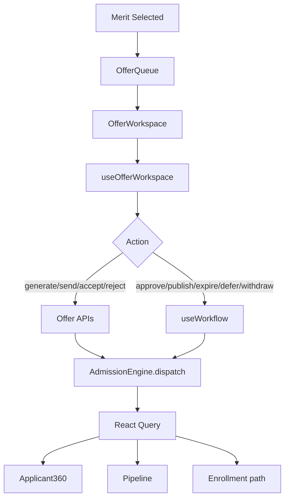

# Phase 5.9 — Enterprise Offer Management & Admission Decision Engine

**Status:** Production-ready vertical slice  
**Route:** `/app/admissions/offers`  
**Constraints:** Zero-risk — no schema, API, RBAC, routing, or backend changes

---

## 1. Enterprise Audit Report (Part 1)

| Area | Before | After |
|------|--------|-------|
| `OfferLetterPage` | Mock Tarun/Priyanka, direct `sendOffer` mutation | Thin wrapper → `OfferWorkspace` |
| Offer generation | None on page | `useOfferWorkspace` → `planOfferAction` → `generateOffer` API |
| Send/resend | Wrong payload `{ id }` | `application_id` via workflow planner |
| Accept/reject | None | `acceptOffer` / `rejectOffer` via hook |
| Status/expiry | Client-side countdown (`expiryDays remaining`) | Backend dates from audit/API only |
| Permissions | None | `canManageOffers`, `canSendOffers`, `canAcceptOffer` |
| Events | `OFFER_SENT` only on send | Full cascade on all offer actions |
| Applicant360 | Partial via `useOffers` | Refreshes on `OFFER_SENT`, `APPLICATION_UPDATED` |

**Removed:** Mock offers, alert-based UX, page-level mutations, local expiry calculation.

---

## 2. Gap Matrix (Part 2)

| Gap | Severity | Impact | Dependencies | Files | Resolution | Regression Risk |
|-----|----------|--------|--------------|-------|------------|-----------------|
| Mock offer table | Critical | Wrong ops data | Offer APIs | `OfferLetterPage.tsx` | `OfferWorkspace` | Low |
| Direct sendOffer | Critical | No sync | `useOfferWorkspace` | Hook layer | Orchestrated actions | Low |
| Local expiry countdown | High | Wrong validity | Audit/API dates | `offer.mapper.ts` | Display backend fields only | Low |
| No GET offer API | High | Audit + generate response | `useApplication` | `offer.mapper.ts` | Parse audit logs | None |
| Template list missing | Medium | Manual template UUID | `generateOffer` | `OfferToolbar.tsx` | Template ID input | None |
| Withdraw/defer no API | Medium | Workflow review | `useWorkflow` | `offer.workflow.ts` | Document limitation | Low |
| Communication center | Low | Event bus only | `OFFER_SENT` | Existing events | No new contract | None |

---

## 3. Architecture Validation (Part 3)

```
Merit / Approved applications
        ↓
Offer Queue (useOfferQueue)
        ↓
Offer Workspace
        ↓
useOfferWorkspace
   ├─ useApplication + useMeritList + useTimeline
   └─ planOfferAction()
       ├─ offer_api → generate / send / accept / reject
       └─ workflow → approve / recommend / review / reject
        ↓
Admission Engine (dispatch)
        ↓
Backend
        ↓
Admission Events
        ↓
Applicant360 · Pipeline · Dashboard · Timeline · Merit · Exam · Interview · Search
```



---

## 4. Offer Workspace (Part 4)

Components deliver dynamic backend-sourced data:

| Component | Purpose |
|-----------|---------|
| `OfferWorkspace` | Main shell, queue + detail views |
| `OfferQueue` | Live application queue |
| `OfferCard` | Candidate offer summary |
| `OfferPreview` | Letter preview from backend record |
| `OfferSummary` | Status KPI tiles |
| `OfferTimeline` / `OfferHistory` | Audit-derived events |
| `OfferFilters` | Status filter chips |
| `OfferToolbar` | All decision actions |
| `OfferDetails` | Field-level offer metadata |
| `OfferAudit` | Audit trail panel |

---

## 5. Offer Workflow (Part 5)

| UI Action | Plan Type | Backend Path |
|-----------|-----------|--------------|
| Generate Offer | `offer_api` | POST `/v1/admission/evaluation/offer/generate` |
| Send / Resend Offer | `offer_api` | POST `/v1/admission/evaluation/offer/send` |
| Accept Offer | `offer_api` | POST `/v1/admission/evaluation/offer/accept` |
| Reject / Cancel Offer | `offer_api` | POST `/v1/admission/evaluation/offer/reject` |
| Approve Offer | `workflow` | POST `/admissions/:id/approve` |
| Publish Offer | `workflow` | POST `/admissions/:id/recommend` |
| Expire / Defer | `workflow` | POST `/admissions/:id/review` |
| Withdraw | `workflow` | POST `/admissions/:id/reject` |

All via `runOfferAction()` — no page-level mutations.

---

## 6. Offer Decision Engine (Part 6)

**Frontend never decides:**

- Offer status (maps backend + audit)
- Expiry validity (displays `expiry_date` only)
- Seat confirmation (maps app status / backend flag)
- Acceptance (backend `acceptOffer`)
- Scholarship / priority (display when present)

---

## 7. Permission Matrix (Part 7)

| Role | View | Generate | Approve | Send | Accept | Reject/Withdraw |
|------|------|----------|---------|------|--------|---------------|
| Principal | ✅ | ✅ | ✅ | ✅ | ✅ | ✅ |
| Admission Officer | ✅ | ✅ | ✅ | ✅ | ✅ | ✅ |
| Parent | ✅* | ❌ | ❌ | ❌ | ✅* | ✅* |
| Counselor | ✅ (read) | ❌ | ❌ | ❌ | ❌ | ❌ |
| Finance | ❌ | ❌ | ❌ | ❌ | ❌ | ❌ |
| Exam Cell | ❌ | ❌ | ❌ | ❌ | ❌ | ❌ |

*With `admission.view_own` or parent role.

---

## 8. Synchronization (Part 8)

`dispatchOfferEvents` fires:

| Event | Applicant360 | Pipeline | Dashboard | Timeline | Queues | Communication |
|-------|--------------|----------|-----------|----------|--------|---------------|
| OFFER_SENT | ✅ | ✅ | ✅ | ✅ | ✅ | via bus refresh |
| APPLICATION_UPDATED | ✅ | ✅ | ✅ | ✅ | ✅ | ✅ |
| APPLICATION_LIST_CHANGED | ✅ | ✅ | — | — | ✅ | — |
| QUEUE_REFRESH | — | ✅ | ✅ | — | ✅ | — |
| TIMELINE_REFRESH | ✅ | — | — | ✅ | — | — |

Communication Center refreshes when Applicant360/timeline hooks refetch on events.

---

## 9. Production Validation (Part 9)

```
Merit → Generate Offer → Approve → Publish → Send → Accept
  → Pipeline / Applicant360 / Dashboard / Timeline / Notification path refresh
```

```bash
cd frontend && npm run build
```

Result: ✅ Zero TypeScript errors (verified).

---

## 10. Matrices & Guides (Part 10)

### API Matrix

| Action | Method | Endpoint |
|--------|--------|----------|
| Generate | POST | `/v1/admission/evaluation/offer/generate` |
| Send | POST | `/v1/admission/evaluation/offer/send` |
| Accept | POST | `/v1/admission/evaluation/offer/accept` |
| Reject | POST | `/v1/admission/evaluation/offer/reject` |
| Approve/Publish/Expire | POST | `/admissions/:id/{approve,recommend,review,reject}` |

### Cache Matrix

| Key | Invalidated By |
|-----|----------------|
| `detail(appId)` | APPLICATION_UPDATED, OFFER_SENT |
| `merit-list(appId)` | APPLICATION_UPDATED |
| `timeline(appId)` | TIMELINE_REFRESH |
| `lists` | APPLICATION_LIST_CHANGED, QUEUE_REFRESH |
| `stats` | DASHBOARD_REFRESH |

### Event Matrix

| Event | Emitter | Subscribers |
|-------|---------|-------------|
| OFFER_SENT | Offer hooks | Applicant360, queues |
| APPLICATION_UPDATED | All offer actions | Full module |
| TIMELINE_REFRESH | Offer success | Timeline, 360 |

### Notification / Communication Matrix

| Action | Notification Path | Communication |
|--------|-------------------|---------------|
| Send Offer | Backend dispatch (mock) + OFFER_SENT event | Applicant360 refetch |
| Accept Offer | OFFER_SENT + APPLICATION_UPDATED | Timeline update |

### Testing Matrix

| Test | Expected |
|------|----------|
| Open `/app/admissions/offers` | Live queue, no mock data |
| Generate with template UUID | Offer created, audit log |
| Send / Accept / Reject | API success + toast + refresh |
| Approve / Publish | Workflow status change |
| Applicant360 | Updates without reload |
| Export | CSV from live record |
| Unauthorized | Access denied |

### Rollback Strategy

Revert `offers/*`, hooks, utils, `OfferLetterPage` wrapper, registry entry, permission helpers. No backend rollback.

### Known Limitations

1. No GET offer endpoint — read from audit + last generate response
2. `sendOffer` backend is mock success (no email payload contract change)
3. Template list requires manual UUID (`admission_offer_templates`)
4. `offer_management` feature flag required
5. Expire/defer/withdraw use workflow review/reject (no dedicated APIs)
6. Letter body preview uses audit metadata, not full template HTML fetch

---

## Files Delivered

```
modules/admission/offers/
  OfferWorkspace.tsx
  OfferQueue.tsx
  OfferCard.tsx
  OfferPreview.tsx
  OfferSummary.tsx
  OfferTimeline.tsx
  OfferHistory.tsx
  OfferFilters.tsx
  OfferToolbar.tsx
  OfferDetails.tsx
  OfferAudit.tsx
  index.ts

hooks/
  useOfferWorkspace.ts
  useOfferQueue.ts

utils/
  offer.mapper.ts (enhanced)
  offer.workflow.ts

pages/
  OfferLetterPage.tsx (thin wrapper)
```
