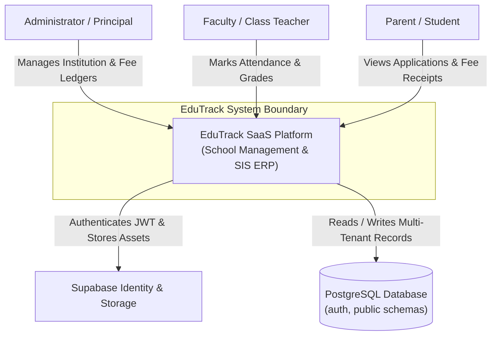
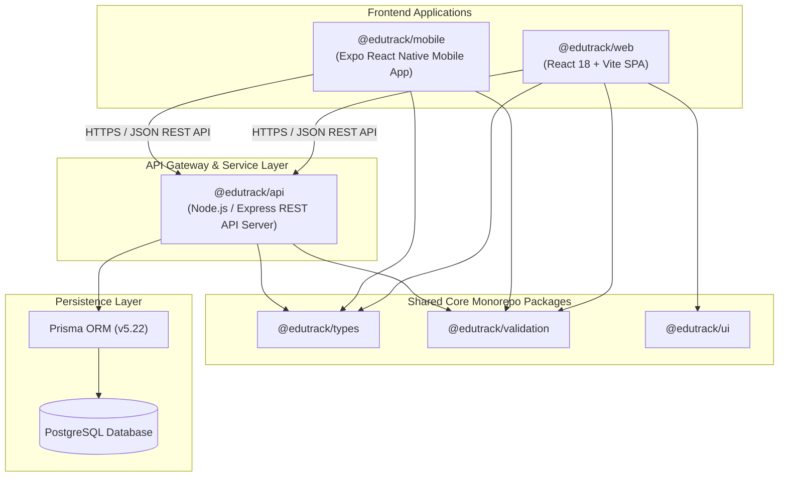
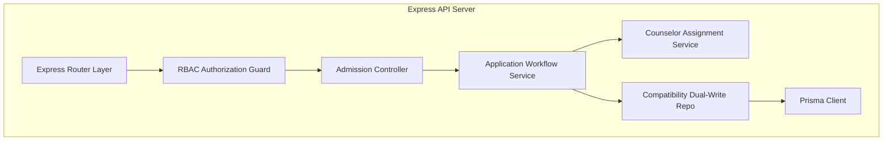

# EduTrack Enterprise Platform — C4 Architecture Model

## 1. System Context Diagram (Level 1)

```mermaid
graph TD
    user_admin["Administrator / Principal"]
    user_teacher["Faculty / Class Teacher"]
    user_parent["Parent / Student"]

    subgraph EduTrack System Boundary
        edutrack_system["EduTrack SaaS Platform\n(School Management & SIS ERP)"]
    end

    ext_supabase["Supabase Identity & Storage"]
    ext_postgres[("PostgreSQL Database\n(auth, public schemas)")]

    user_admin -->|Manages Institution & Fee Ledgers| edutrack_system
    user_teacher -->|Marks Attendance & Grades| edutrack_system
    user_parent -->|Views Applications & Fee Receipts| edutrack_system

    edutrack_system -->|Authenticates JWT & Stores Assets| ext_supabase
    edutrack_system -->|Reads / Writes Multi-Tenant Records| ext_postgres
```

---

## 2. Container Diagram (Level 2)

```mermaid
graph TD
    subgraph Frontend Applications
        web_app["@edutrack/web\n(React 18 + Vite SPA)"]
        mobile_app["@edutrack/mobile\n(Expo React Native Mobile App)"]
    end

    subgraph API Gateway & Service Layer
        express_api["@edutrack/api\n(Node.js / Express REST API Server)"]
    end

    subgraph Shared Core Monorepo Packages
        pkg_types["@edutrack/types"]
        pkg_val["@edutrack/validation"]
        pkg_ui["@edutrack/ui"]
    end

    subgraph Persistence Layer
        prisma_orm["Prisma ORM (v5.22)"]
        postgres_db[("PostgreSQL Database")]
    end

    web_app -->|HTTPS / JSON REST API| express_api
    mobile_app -->|HTTPS / JSON REST API| express_api

    web_app --> pkg_types & pkg_val & pkg_ui
    mobile_app --> pkg_types & pkg_val
    express_api --> pkg_types & pkg_val

    express_api --> prisma_orm
    prisma_orm --> postgres_db
```

---

## 3. Component Diagram (Level 3 - Backend API)

```mermaid
graph TD
    subgraph Express API Server
        router["Express Router Layer"]
        rbac_guard["RBAC Authorization Guard"]
        admission_ctrl["Admission Controller"]
        admission_service["Application Workflow Service"]
        counselor_service["Counselor Assignment Service"]
        compat_repo["Compatibility Dual-Write Repo"]
        prisma["Prisma Client"]
    end

    router --> rbac_guard
    rbac_guard --> admission_ctrl
    admission_ctrl --> admission_service
    admission_service --> counselor_service
    admission_service --> compat_repo
    compat_repo --> prisma
```
