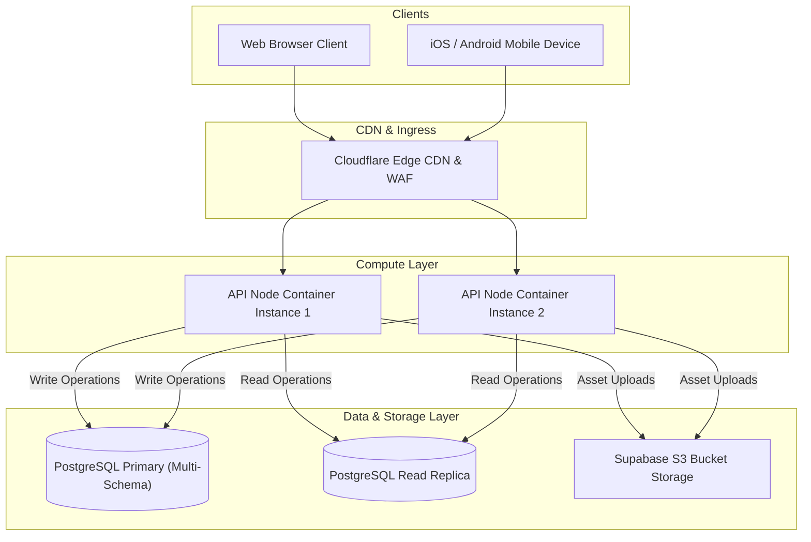

# EduTrack Enterprise Platform — Deployment & Network Topology

## 1. Network Topology Diagram

```mermaid
flowchart TD
    subgraph Clients
        BROWSER[Web Browser Client]
        MOBILE_DEVICE[iOS / Android Mobile Device]
    end

    subgraph CDN & Ingress
        CLOUDFLARE[Cloudflare Edge CDN & WAF]
    end

    subgraph Compute Layer
        API_INSTANCE_1[API Node Container Instance 1]
        API_INSTANCE_2[API Node Container Instance 2]
    end

    subgraph Data & Storage Layer
        POSTGRES_PRIMARY[("PostgreSQL Primary (Multi-Schema)")]
        POSTGRES_REPLICA[("PostgreSQL Read Replica")]
        SUPABASE_STORAGE[Supabase S3 Bucket Storage]
    end

    BROWSER & MOBILE_DEVICE --> CLOUDFLARE
    CLOUDFLARE --> API_INSTANCE_1 & API_INSTANCE_2
    API_INSTANCE_1 & API_INSTANCE_2 -->|Write Operations| POSTGRES_PRIMARY
    API_INSTANCE_1 & API_INSTANCE_2 -->|Read Operations| POSTGRES_REPLICA
    API_INSTANCE_1 & API_INSTANCE_2 -->|Asset Uploads| SUPABASE_STORAGE
```
