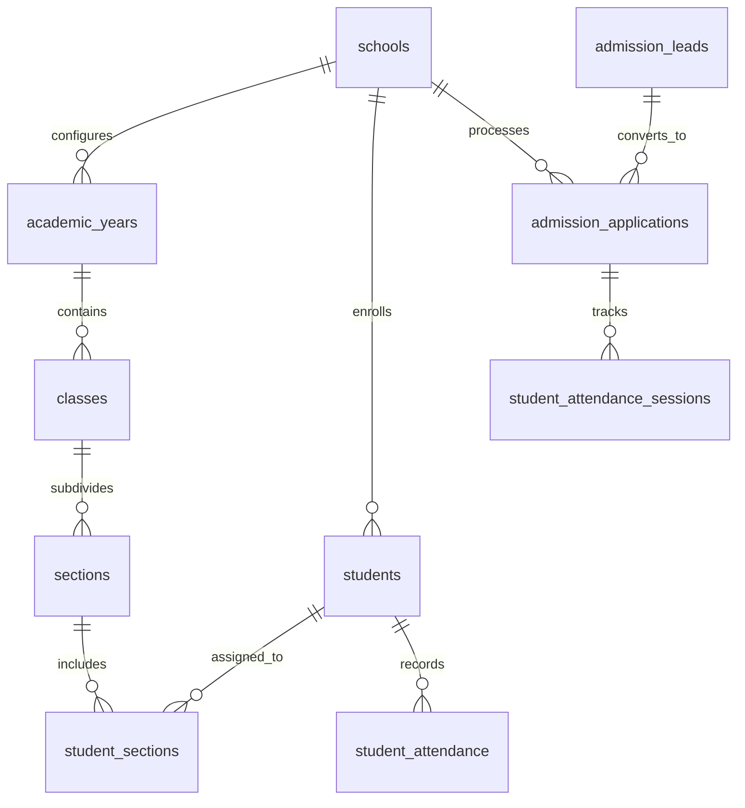

# EduTrack Enterprise Platform — Database Architecture

## 1. Relational Schema & Multi-Schema Isolation

The database architecture is built on PostgreSQL with multi-schema segregation (`auth` and `public` schemas) managed via Prisma ORM (`apps/backend/prisma/schema.prisma`).

---

## 2. Master Entity Categories

### 2.1 Multi-Tenant Governance

- `schools`: Root institution record storing school codes, settings, and status.
- `academic_years`: Annual academic calendar sessions (`is_active`, `status: OPEN / CLOSED`).

### 2.2 Academic Hierarchy

- `classes`: Grade levels (e.g., Grade 10).
- `sections`: Section divisions (e.g., Section A).
- `student_sections`: Maps active students to specific sections per academic year.
