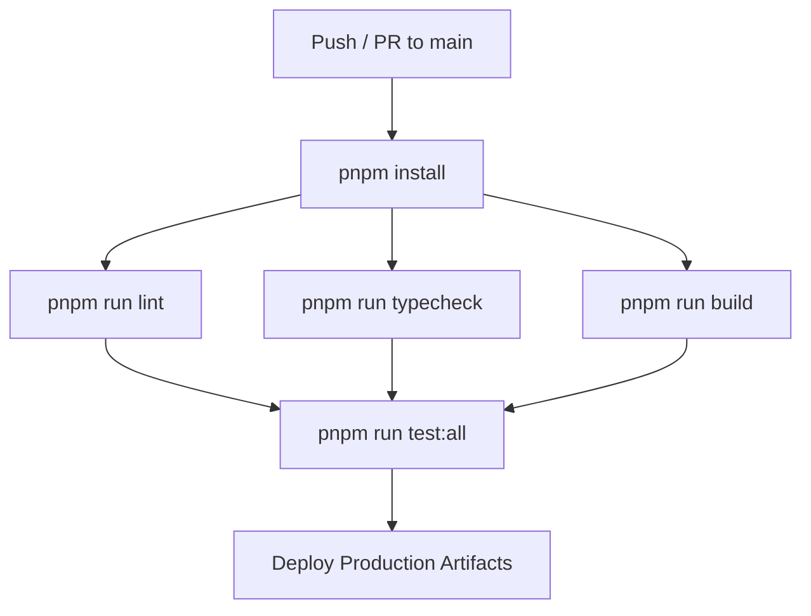

# EduTrack Enterprise Platform — DevOps & Deployment Architecture

## 1. CI/CD Pipeline & Quality Automation

Continuous integration pipelines run via GitHub Actions (`.github/workflows/`):

---

## 2. Environment Variables Governance

- `apps/backend/.env`: `DATABASE_URL`, `DIRECT_URL`, `SUPABASE_URL`, `SUPABASE_KEY`, `PORT`.
- `apps/web_app/.env`: `VITE_SUPABASE_URL`, `VITE_SUPABASE_ANON_KEY`, `VITE_API_URL`.
- `apps/mobile_app/.env`: `EXPO_PUBLIC_API_URL`, `EXPO_PUBLIC_SUPABASE_URL`.

Real values for all of the above belong **only** in Render's / Netlify's
environment variable dashboards, never in tracked files. See
[`DATABASE-CONFIGURATION-MISMATCH.md`](./DATABASE-CONFIGURATION-MISMATCH.md)
for the confirmed production Supabase project (`umvbyywkojuxnxgkuwbt`) that
`SUPABASE_URL`, `DATABASE_URL`, and `DIRECT_URL` must all point to, and
`apps/backend/.env.example` for the full list of variables the backend
actually reads.

### Required Netlify environment variables

`VITE_API_URL` is already set for production in `netlify.toml`. The
following two must be configured in Netlify's dashboard (Site settings →
Environment variables) — they are intentionally not committed anywhere:

- `VITE_SUPABASE_URL` — the `umvbyywkojuxnxgkuwbt` project URL.
- `VITE_SUPABASE_ANON_KEY` — the `umvbyywkojuxnxgkuwbt` anon (public) key.

See `apps/web_app/.env.example` for the local-development equivalents.
