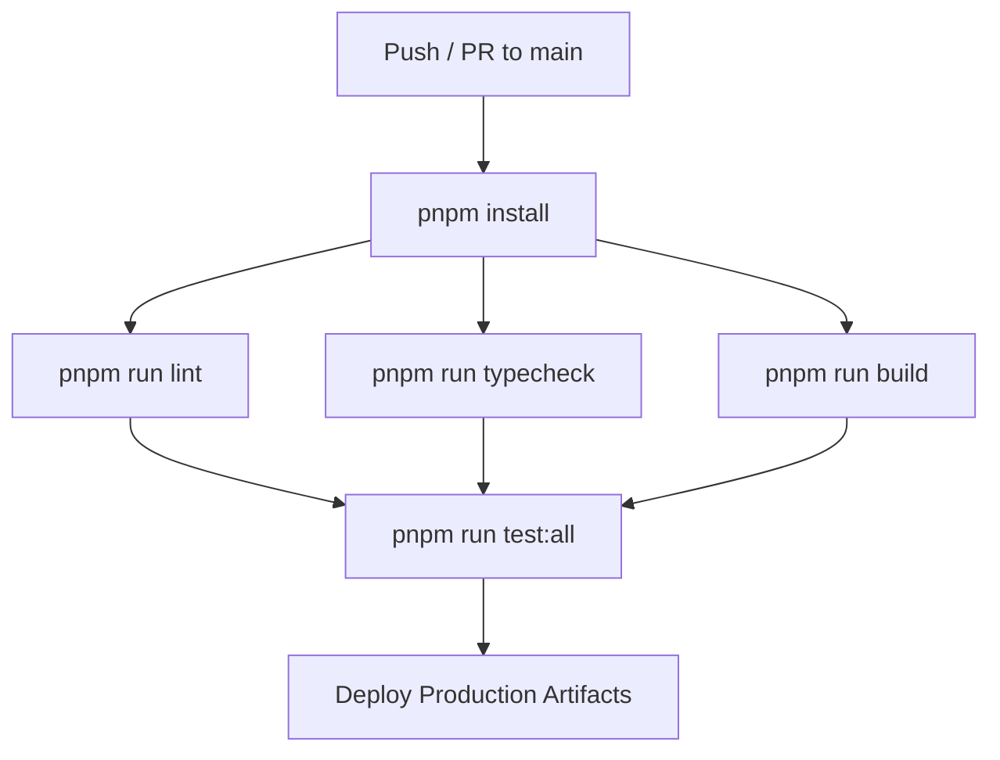

# EduTrack Enterprise Platform — DevOps & Deployment Architecture

## 1. CI/CD Pipeline & Quality Automation

Continuous integration pipelines run via GitHub Actions (`.github/workflows/`):

---

## 2. Environment Variables Governance

- `apps/backend/.env`: `DATABASE_URL`, `DIRECT_URL`, `SUPABASE_URL`, `SUPABASE_KEY`, `PORT`.
- `apps/web_app/.env`: `VITE_SUPABASE_URL`, `VITE_SUPABASE_ANON_KEY`, `VITE_API_URL`.
- `apps/mobile_app/.env`: `EXPO_PUBLIC_API_URL`, `EXPO_PUBLIC_SUPABASE_URL`.
