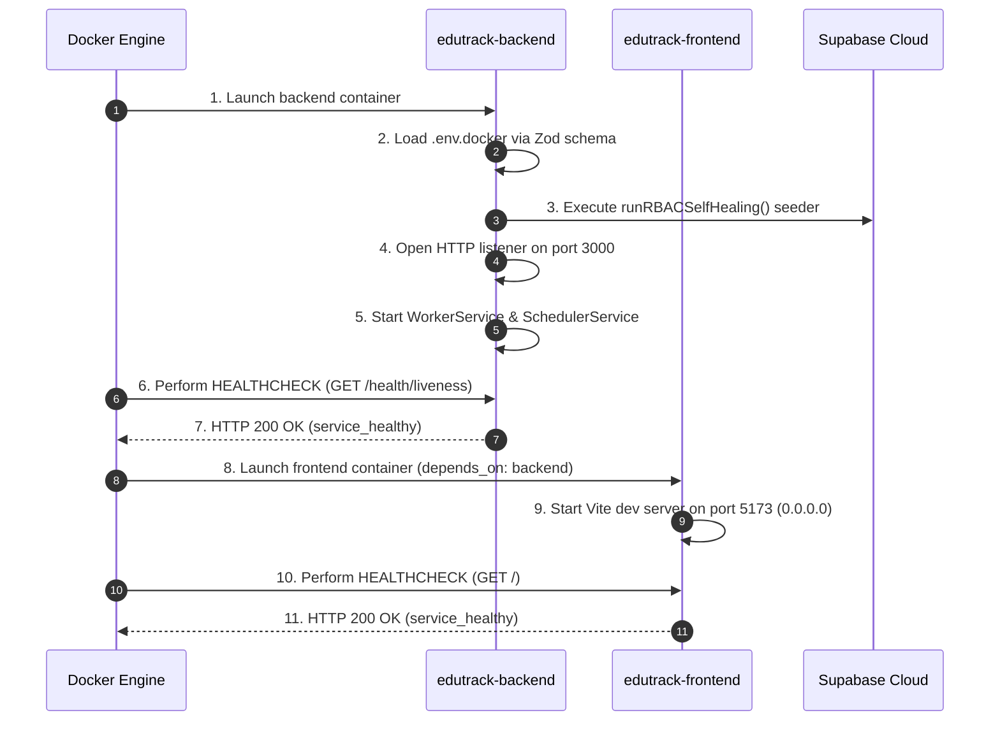

# EduTrack Enterprise SaaS ERP — Container Architecture & Infrastructure Specification

**Architecture Version:** 2.12.0  
**Status:** Active Infrastructure Standard  
**Maintainer:** Principal Enterprise DevOps & Infrastructure Team

---

## 1. Executive Summary

The EduTrack Enterprise SaaS ERP container infrastructure is engineered around a **2-Container Target Architecture** operating over a dedicated bridge network (`edutrack-network`).

The architecture segregates the client-facing single page web application (`edutrack-frontend`) from the backend API microservice (`edutrack-backend`), while delegating database storage, authentication, and file blob storage to **Supabase Cloud**.

```mermaid
graph TD
    subgraph Client Layer
        BROWSER[User Web Browser]
    end

    subgraph Docker Container Environment (edutrack-network)
        subgraph Container 1: Frontend SPA
            FRONTEND["edutrack-frontend\n(React 18 + Vite Dev Server)\nPort: 5173\nUser: node (UID 1000)"]
        end

        subgraph Container 2: Backend API
            BACKEND["edutrack-backend\n(Express + Prisma + Puppeteer)\nPort: 3000\nUser: node (UID 1000)"]
            EXPRESS["Express REST API"]
            WORKER["WorkerService Queue Loop (3s)"]
            SCHEDULER["SchedulerService Cache Maintenance (10m)"]
            PUPPETEER["Debian Chromium PDF Engine"]

            BACKEND --> EXPRESS
            BACKEND --> WORKER
            BACKEND --> SCHEDULER
            BACKEND --> PUPPETEER
        end
    end

    subgraph External Infrastructure (Cloud)
        SUPABASE_CLOUD[("Supabase Cloud Infrastructure\nPostgreSQL DB (Port 5432) & Auth API (HTTPS)")]
    end

    BROWSER -->|HTTP Port 5173| FRONTEND
    BROWSER -->|HTTP Port 3000| BACKEND
    FRONTEND -->|Internal Bridge Resolution\nhttp://backend:3000| BACKEND
    BACKEND -->|Outbound TLS & DB Connection| SUPABASE_CLOUD
```

---

## 2. Container Responsibilities

### A. Backend Container (`edutrack-backend`)

- **Service Name:** `backend`
- **Base Image:** `node:20-bookworm-slim` (Debian 12 Slim for native Chromium & Prisma glibc binary stability).
- **Core Responsibilities:**
  - Serving Express.js REST API requests on Port `3000`.
  - Executing internal `WorkerService` job queue polling loops (3-second interval).
  - Executing `SchedulerService` cache maintenance (10-minute interval).
  - Executing `runRBACSelfHealing()` database sync on boot.
  - Rendering HTML-to-PDF reports via headless Debian Chromium (`puppeteer`).
  - Managing PostgreSQL query streams via Prisma ORM (`v5.22.0`).
- **Runtime User:** `node` (UID 1000 - Non-root execution with `chown` directory ownership).

### B. Frontend Container (`edutrack-frontend`)

- **Service Name:** `frontend`
- **Base Image:** `node:20-alpine` (Lightweight Alpine Linux runtime for Vite dev server).
- **Core Responsibilities:**
  - Serving React 18 SPA assets via Vite Development Server on Port `5173`.
  - Providing client-side hot reloading support bound to `0.0.0.0`.
  - Proxying client requests to backend API endpoints.
- **Runtime User:** `node` (UID 1000 - Non-root execution).

---

## 3. Startup & Boot Order



---

## 4. Networking & Port Mapping

| Container Name      | Exposed Host Port | Internal Container Port | Internal DNS Alias | Protocol        | Network                     |
| :------------------ | :---------------- | :---------------------- | :----------------- | :-------------- | :-------------------------- |
| `edutrack-backend`  | `3000`            | `3000`                  | `backend`          | HTTP / REST     | `edutrack-network` (bridge) |
| `edutrack-frontend` | `5173`            | `5173`                  | `frontend`         | HTTP / Vite HMR | `edutrack-network` (bridge) |

---

## 5. Health Checks & Restart Policies

### Restart Policy

Both application containers are configured with:

```yaml
restart: unless-stopped
```

This ensures container recovery across host reboots or unhandled application panics while allowing manual container stop commands.

### Health Probes

- **Backend Probe:**
  ```yaml
  healthcheck:
    test:
      ['CMD', 'wget', '--quiet', '--tries=1', '--spider', 'http://localhost:3000/health/liveness']
    interval: 10s
    timeout: 5s
    retries: 5
    start_period: 15s
  ```
- **Frontend Probe:**
  ```yaml
  healthcheck:
    test: ['CMD', 'wget', '--quiet', '--tries=1', '--spider', 'http://localhost:5173/']
    interval: 10s
    timeout: 5s
    retries: 5
    start_period: 10s
  ```

---

## 6. Volume Architecture & Hot Reload Workflow

```yaml
volumes:
  pnpm_store:
  backend_node_modules:
  frontend_node_modules:

services:
  backend:
    volumes:
      - ./apps/backend/src:/app/apps/backend/src:ro
      - ./packages:/app/packages:ro
      - backend_node_modules:/app/apps/backend/node_modules
      - pnpm_store:/root/.local/share/pnpm/store

  frontend:
    volumes:
      - ./apps/web_app/src:/app/apps/web_app/src:ro
      - ./apps/web_app/public:/app/apps/web_app/public:ro
      - ./packages:/app/packages:ro
      - frontend_node_modules:/app/apps/web_app/node_modules
      - pnpm_store:/root/.local/share/pnpm/store
```

### Host Isolation & Hot Reload Behavior

1. **Host Isolation:** Named `node_modules` volumes (`backend_node_modules`, `frontend_node_modules`) prevent container dependencies from clashing with host OS filesystems.
2. **Hot Reload:** Source directories (`src/`, `public/`, `packages/`) are mounted read-only (`:ro`). Source changes on the host host automatically trigger:
   - **Backend:** Nodemon re-compiles TypeScript and restarts Express.
   - **Frontend:** Vite HMR propagates changes to browser windows via WebSockets on port 5173.

---

## 7. Environment & Secret Management Strategy

| File Path          | Environment Purpose                                                      | Git Status      |
| :----------------- | :----------------------------------------------------------------------- | :-------------- |
| `.env.docker`      | Loaded by `docker-compose.yml` (`env_file`) for containerized execution. | Tracked         |
| `.env.development` | Used for non-containerized local development.                            | Tracked         |
| `.env.production`  | Production deployment configuration template.                            | Tracked         |
| `.env.example`     | Public variable template with dummy placeholders.                        | Tracked         |
| `.env.local`       | Local overrides containing private developer keys.                       | **Git Ignored** |

---

## 8. Known Limitations & Future Architecture

1. **Embedded Background Workers:** In the current phase, `WorkerService` and `SchedulerService` execute inside the `edutrack-backend` process loop. Future scaling phases will decouple background workers into dedicated container instances using the same base image.
2. **External Cloud Dependency:** Application boot requires active internet access to resolve Supabase Cloud PostgreSQL connection strings (`DATABASE_URL`) and Auth APIs.
