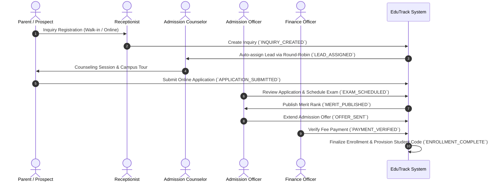
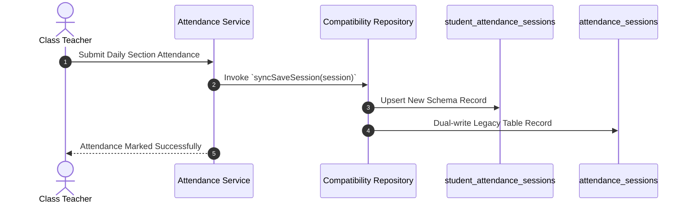

# EduTrack Enterprise Platform — End-to-End Business Workflows

## 1. Admissions Pipeline Workflow

```mermaid
sequenceDiagram
    autonumber
    actor Parent as Parent / Prospect
    actor Rec as Receptionist
    actor Counselor as Admission Counselor
    actor Officer as Admission Officer
    actor Fin as Finance Officer
    participant Sys as EduTrack System

    Parent->>Rec: Inquiry Registration (Walk-in / Online)
    Rec->>Sys: Create Inquiry (`INQUIRY_CREATED`)
    Sys->>Counselor: Auto-assign Lead via Round-Robin (`LEAD_ASSIGNED`)
    Counselor->>Parent: Counseling Session & Campus Tour
    Parent->>Sys: Submit Online Application (`APPLICATION_SUBMITTED`)
    Officer->>Sys: Review Application & Schedule Exam (`EXAM_SCHEDULED`)
    Sys->>Officer: Publish Merit Rank (`MERIT_PUBLISHED`)
    Officer->>Sys: Extend Admission Offer (`OFFER_SENT`)
    Fin->>Sys: Verify Fee Payment (`PAYMENT_VERIFIED`)
    Sys->>Sys: Finalize Enrollment & Provision Student Code (`ENROLLMENT_COMPLETE`)
```

---

## 2. Attendance & Compatibility Dual-Write Workflow

```mermaid
sequenceDiagram
    autonumber
    actor Teacher as Class Teacher
    participant Sys as Attendance Service
    participant DualRepo as Compatibility Repository
    participant NewDB as student_attendance_sessions
    participant LegDB as attendance_sessions

    Teacher->>Sys: Submit Daily Section Attendance
    Sys->>DualRepo: Invoke `syncSaveSession(session)`
    DualRepo->>NewDB: Upsert New Schema Record
    DualRepo->>LegDB: Dual-write Legacy Table Record
    Sys-->>Teacher: Attendance Marked Successfully
```
